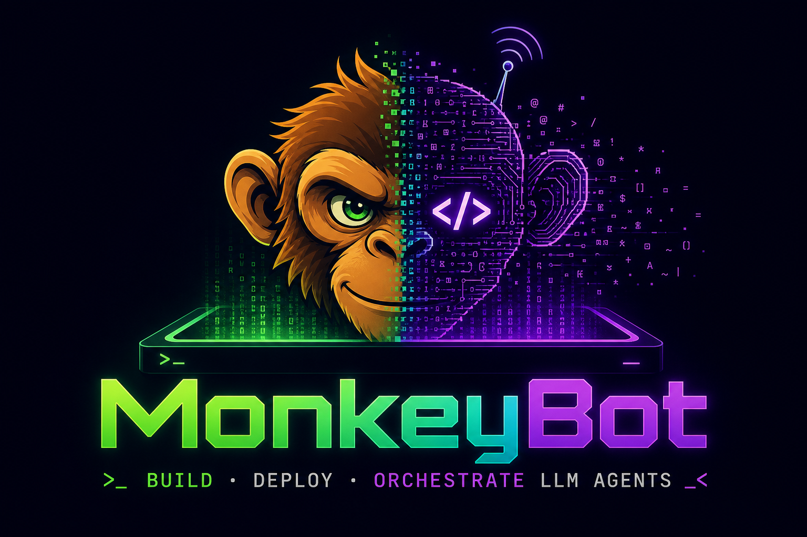

# MonkeyBot

<div align="center">
  

  <br />

  *Production-ready Python framework for building and deploying LLM agents*

  [](LICENSE)

</div>

MonkeyBot (`monkeybot`) is a thin framework for running **tool-using LLM agents** with a **FastAPI SSE gateway**, **SQLite** conversation storage, **MCP** tool servers, and optional skills and memory workflows — wired for local dev and deployable on GCP Cloud Run (or anywhere Docker runs).

> [!NOTE]
> **Not on PyPI yet** — install from a clone of this repository. Skills under `SKILLS_PATH` execute Python code; only add skills from trusted sources.

## Installation

```bash
git clone https://github.com/human-and-machine/monkey-bot.git
cd monkey-bot
uv sync
uv run monkeybot-init-config
uv run python -m monkeybot.gateway.main
```

For a browser chat UI, run **`./run-playground.sh`** from the repo root and open `http://localhost:5173`. Full setup (config, `.env`, MCP, Docker): **[Getting Started](docs/getting-started.md)**.

## Requirements

Python 3.11+ · [uv](https://docs.astral.sh/uv/) · optional provider keys in `.env` (Gemini, OpenAI, Anthropic)

## Key capabilities

- [**Agent loop**](src/monkeybot/core/runtime/loop.py) — streaming providers, tool execution, SQLite-backed turns
- [**SSE gateway**](src/monkeybot/gateway/sse/) — FastAPI sessions and event stream for clients
- [**AGENT.md + skills**](docs/skills.md) — system prompt from file plus `SKILL.md` discovery under `SKILLS_PATH`
- [**MCP**](docs/mcp.md) — stdio and streamable HTTP MCP servers; tools exposed as `server__tool`
- [**Playground**](playground/) — local gateway (`playground/agent`) and Vite + React chat UI
- [**Multi-provider**](src/monkeybot/providers/) — Gemini (Vertex), OpenAI, Anthropic, Bedrock via `get_provider_config()`

**Config:** copy or scaffold **`monkeybot_config/monkeybot.yaml`** from **`monkeybot_config/monkeybot.example.yaml`**. Secrets go in **`.env`** — see the YAML header for variable names.

## Documentation

| Guide | Description |
|---|---|
| [Getting Started](docs/getting-started.md) | Install, configure the gateway, and exercise sessions + SSE from the command line |
| [SSE gateway and custom UI](docs/sse-gateway-ui.md) | HTTP + SSE endpoints, event types, CORS/proxy notes, and the playground chat UI flow |
| [Skills](docs/skills.md) | Skill directory layout and `SKILL.md` discovery |
| [Model Context Protocol](docs/mcp.md) | MCP configuration, env interpolation, OAuth2 flows, and diagnostics |
| [Cloud deployment](docs/cloud-deployment-design.md) | Container and serverless deploy patterns for GCP, AWS, and more |

## Integrations

| Integration | Status | Purpose |
|---|---|---|
| **Google Vertex AI** (Gemini) | Production | Primary LLM provider (gateway + `GeminiProvider`) |
| **Google Cloud Run** | Production | Serverless container hosting |
| **SQLite** | Default (SSE gateway) | Session history and per-turn usage |
| **Google Cloud Firestore** | Supported (`monkeybot[firestore]`) | Session history, threads, and usage via `firestore://` DB_URL |
| **Google Cloud Storage** | Optional (`monkeybot[gcs]`) | Long-term memory and file sync |
| **GCP Secret Manager** | Production | Production secrets management |
| **Google Chat** | Optional | Workspace Add-on interface (when deployed) |
| **OpenAI** | Supported | `OpenAIProvider` (`monkeybot[openai]`) via `get_provider_config()` |
| **Anthropic Claude** | Supported | `ClaudeProvider` (`monkeybot[claude]`) via `get_provider_config()` |
| **Anthropic via Vertex AI** | Supported | `VertexClaudeProvider` (`anthropic[vertex]`) |
| **AWS Bedrock** | Supported | `BedrockClaudeProvider` (`monkeybot[bedrock]`); `MODEL_PROVIDER=aws_bedrock` |
| **AWS S3** | Planned | Memory store backend |
| **AWS Secrets Manager** | Planned | Secret resolver |
| **Azure OpenAI** | Coming Soon | Azure-hosted OpenAI models |
| **Azure Blob Storage** | Coming Soon | Memory backend for Azure deployments |
| **Azure Key Vault** | Coming Soon | Secrets for Azure deployments |
| **Slack** | Coming Soon | Slack bot interface |
| **Microsoft Teams** | Coming Soon | Teams bot interface |
| **Telegram** | Coming Soon | Telegram bot interface |
| **DynamoDB** | Planned | Checkpointer / job storage |
| **CosmosDB** | Coming Soon | Azure-native persistence options |

For provider and cloud wiring, start from **`monkeybot_config/monkeybot.example.yaml`** and the [Cloud deployment](docs/cloud-deployment-design.md) guide.

## Development

```bash
uv sync
uv run pytest
uv run ruff check .
uv run mypy src/
```

## Support

If you need help or hit a problem, search existing issues or open a new one in the [GitHub issue tracker](https://github.com/human-and-machine/monkey-bot/issues).

## Contributing

Contributions are welcome. You can help by:

- Reporting bugs or gaps in the docs (via issues).
- Suggesting new providers, interfaces, or deployment patterns (feature requests welcome).
- Opening pull requests for fixes and improvements.

Run checks before submitting: `uv run pytest && uv run ruff check . && uv run mypy src/`

## License

You may use, modify, and distribute MonkeyBot under the MIT license. See the [`LICENSE`](LICENSE) file for details.
