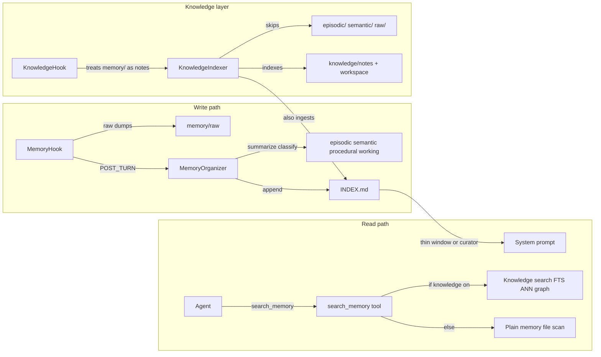
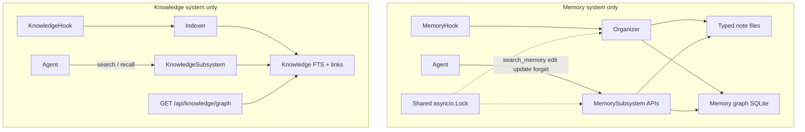

# Memory Graph + Knowledge Full Split

**Repo:** monkeybot  
**Status:** Proposed (revised after John review 2026-07-20)  
**Decisions locked:** Obsidian-style memory graph (not folder-primary); full split from knowledge; knowledge visualization last.

## Summary

Fully separate memory from the knowledge layer, evolve memory into an Obsidian-style note graph with mutation tools (so stale facts can be retired), make typed folders agent-useful classification metadata, and add a knowledge-graph visualization API at the end.

**Review incorporation:** phase-1 includes all prompt conflation flips (no silent regression window); `knowledge/hook.py` is in the split; agent routing is fully specified; routing eval, `working/` GC ownership, and organizer/mutation locking are explicit. **No backward compatibility** — new note/graph conventions are required going forward; no migration of status-less notes.

---

## How the current system performs

### What works today

- Hook captures cheaply; organizer classifies into typed folders and appends `INDEX.md` lines already shaped like `- [[folder/file.md]] | …`.
- Prompt gets a thin index slice; `search_memory` can dig into note bodies.

### What fails / is wasteful

- **Intertwined retrieval:** when knowledge is enabled, `_tool_search_memory` in `src/monkeybot/core/tools/core_tool_executor.py` delegates to knowledge search — memory and knowledge compete as one corpus.
- **Knowledge still indexes memory:** indexer ingests `memory/*` (including `INDEX.md`) as `source_type: note`; fusion only demotes some paths. That contradicts a clean split and made hub/`INDEX.md` noise a real eval failure mode.
- **Knowledge hook still treats memory as vault notes:** `_looks_like_note_path` in `src/monkeybot/core/knowledge/hook.py` matches `memory/` and schedules notes rescans on memory writes.
- **Prompt conflation:** several surfaces push the model toward `search` for past-context questions that will stop working after the corpus split (see phase 1 checklist below).
- **Folders underused:** `procedural/` and `working/` exist in `BUILT_IN_FOLDERS` (`src/monkeybot/core/memory/organizer.py`) but classify prompts only list bare names, scaffold does not create empty trees, and the harness never teaches the agent what they mean — so they rarely appear.
- **Append-only / stale facts:** no `edit` / `update` / `forget` tools. Fixed tools stay “broken” in old notes; new notes do not supersede old ones.
- **Folders alone ≠ Obsidian:** Obsidian’s value for agents is **nodes (notes) + edges (`[[links]]`)** with traversal. Today memory has wiki-link *syntax* in `INDEX.md` but no graph store, no supersedes edges, and no agent tools that write/walk links. Folders are only path prefixes.

---

## Target architecture

- **Memory shape: Obsidian-style graph.** Notes are nodes; `[[wiki links]]` and explicit `supersedes` / `related` edges are first-class. Typed folders remain **soft type labels** on the path (`episodic/…`, `procedural/…`, …), not the primary retrieval model.
- **Full split from knowledge.** Memory never feeds knowledge indexing, hooks, or search; `search_memory` never calls knowledge. Knowledge owns workspace + `.monkeybot/knowledge/notes/` only.
- **Clear agent routing.** After the split, two disjoint corpora; the model must choose correctly every time (contrastive tool text, empty-result cross-referral, memory teaching block, framed injections).
- **Visualization last:** `GET` knowledge graph API (nodes + edges JSON; optional simple HTML) after the split/tools land.

---

## What each fix does

### 1. Untangle `search_memory` from knowledge + flip all prompt conflation (same phase / ideally same commit)

**Plumbing**
- Remove the “prefer unified search” branch in `src/monkeybot/core/tools/core_tool_executor.py` so `search_memory` always uses `MemorySubsystem.search_files` (graph-aware after the memory-graph phase).
- Flip `tests/core/test_core_tool_executor.py` (`test_recall_and_search_memory_delegate`) to assert **non**-delegation.
- Keep `search` / `recall` as knowledge-only surfaces.

**Prompt / tool-description conflation (must land with the split — no regression window)**

| Surface | Today | After phase 1 |
|---------|-------|----------------|
| `harness_prompt.py` tool line (~37) | `search_memory` “delegates to `search` when knowledge is on” | Memory-only keyword/graph search; never delegates |
| `harness_prompt.py` memory URI line (~62) | “`search` indexes workspace files plus notes” / prefer both | Knowledge indexes workspace + knowledge notes only; memory URI is for `search_memory` |
| `context/__init__.py` `search_memory` tool description (~598) | “Prefer `search` for conceptual / cross-file knowledge” | Contrastive: past events/decisions/preferences/sessions → `search_memory`; not for code/workspace |
| `context/__init__.py` `search` schema / path_prefix docs | mentions `memory/` | workspace / `notes/` only |
| `prompts/prompt.py` curator nudge (~136) | “Use `search` (or `search_memory`)…” | Prefer `search_memory` for older/unstated *session* context; `search` for workspace/code |

### 2. Full split: knowledge never indexes or hooks `memory/`

- Expand skip policy in `src/monkeybot/core/knowledge/indexer.py`: treat **all** `memory/` as out of corpus (not only `raw/episodic/semantic`). Drop / no-op the `memory/` ingest branch; on rescan prune existing `memory/*` rows + vectors.
- **`knowledge/hook.py`:** remove `memory/` from `_looks_like_note_path` so memory writes no longer set `_notes_dirty` or schedule notes rescans.
- Tighten `src/monkeybot/core/knowledge/fusion.py` noise filters (defense in depth for any stale rows until pruned).
- Update knowledge design comments that still describe memory as part of the vault.

### 3. Agent routing (read side) — four mechanisms

After the split there are two disjoint corpora. Spec, in leverage order:

1. **Contrastive tool descriptions** (highest impact — what the model reads at call time):
   - `search_memory` → “past events, decisions, user preferences, prior sessions; **not** for code/workspace — use `search`.”
   - `search` → “workspace + knowledge notes; **has no record of past conversations** — use `search_memory`.”
2. **Cross-referral on empty results:** a zero-hit `search_memory` payload appends a short note: “no memory matches — if this is about workspace content, use `search`” (and vice versa on empty `search`). Catches wrong-lane calls at decision time; zero cost on good calls.
3. **Memory teaching block** mirroring `_KNOWLEDGE_SEARCH_BLOCK` in `harness_prompt.py`:
   - Four types in one line each (episodic / semantic / procedural / working).
   - Routing rule: what happened → memory; how does code work → knowledge; why is it this way → both, **memory first**.
   - When to call `update_memory` / `forget` (once those tools exist; until then, omit or stub the mutation lines).
4. **Frame injected context:** `## Memory index` and PRE_TURN hits are currently bare bullets. Add one framing line each, e.g. “stored memories from past sessions; entries are titles — `search_memory` retrieves the full note.”

Phase 1 ships items 1–2 and the non-mutation parts of 3–4 (routing + framing) so behavior does not regress. Phase 3 extends the teaching block with full taxonomy + mutation guidance once tools exist.

### 4. Make typed folders real for the agent (soft types on the graph)

- Rich classify descriptions in organizer:
  - **episodic** — events / what happened
  - **semantic** — durable facts
  - **procedural** — how-tos / recipes
  - **working** — short-lived scratch (see GC below)
- Scaffold creates empty `episodic/`, `semantic/`, `procedural/`, `working/`, `raw/` under `memory/` (`cli/src/monkeybot_cli/scaffold.py`).
- `search_memory` gains optional `folder` / `type` filter.
- Prefer `working/` for ephemeral tool noise; demote `working/` from prompt injection (skip in PRE_TURN inject + index window unless the query filters for it).

### 5. `working/` TTL / GC (owner + trigger)

- **Owner:** `MemorySubsystem` (same process that owns organizer + mutation tools).
- **Trigger:** run a `gc_working()` pass (a) at gateway startup alongside existing memory GC, and (b) at the start of each debounced organizer `run()` before processing `raw/`.
- **Rule:** delete (or move to `forgotten/` with `status: forgotten`) any `working/*.md` whose mtime (or frontmatter `created:`) is older than **7 days** (config: `memory.working_ttl_days`, default 7). Also drop corresponding active `INDEX.md` rows and graph sidecar nodes/edges.
- **Not** session-end deletion — working notes may span sessions within the TTL window.

### 6. Memory mutation tools + graph (Obsidian-style)

Reuse wiki-link parsing ideas from `src/monkeybot/core/knowledge/links.py` but **own a separate** memory graph sidecar (e.g. `memory/.graph.sqlite`) — not the knowledge DB.

**Note body convention**

- Every note written by the organizer or mutation tools **must** include frontmatter: `type:`, `status: active|superseded|forgotten`, optional `supersedes: [[path]]`, plus inline `[[links]]`. No support for status-less notes.
- On graph sidecar open / organizer write: parse `[[wiki links]]` into the edges table; index only notes with valid frontmatter.
- `INDEX.md` entries whose target is missing or `forgotten`/`superseded` are dropped from the active prompt window.
- `update_memory` writes a new active note, marks the old note `superseded`, adds a `supersedes` edge, refreshes `INDEX.md` (active entries only).
- `forget` sets `forgotten` (or soft-deletes into `forgotten/`), removes from active `INDEX.md`, keeps edge history for audit.
- `edit_memory` in-place rewrite of an active note’s body + reparse links (no new node).

**Tools** (registered next to `search_memory` in tool defs + `CoreToolExecutor`)

| Tool | Behavior |
|------|----------|
| `search_memory` | Keyword (+ optional 1-hop graph expand on memory links); prefer `status=active`; optional `folder`; empty-result cross-referral |
| `edit_memory` | `path` + new `content` |
| `update_memory` | `path` or query hit + `content` → supersede |
| `forget` | `path` or query → retire |

Wire through `src/monkeybot/core/memory/subsystem.py`. Subagents: read + search only (no mutate), same as today’s write-hook policy.

**Retrieval rule for stale facts:** search and prompt injection ignore `superseded` / `forgotten` unless `include_retired=true`.

**Concurrency / locking**

- Today `MemoryHook` owns an `asyncio.Lock` shared with organizer writes on `INDEX.md` / `raw/` (`hook.py`).
- Expose that lock on `MemorySubsystem` (or move ownership to the subsystem).
- `edit_memory` / `update_memory` / `forget` **must acquire the same lock** for note body writes, `INDEX.md` refresh, and sidecar graph updates — so mid-turn mutations cannot race a debounced organizer run.

### 7. Knowledge visualization endpoint (final phase)

- Add `GET /api/knowledge/graph` on the SSE gateway (`src/monkeybot/gateway/sse/routes.py`): JSON `{ nodes: [{id, path, source_type}], edges: [{source, target, link_type}] }` from `KnowledgeIndex`.
- Add `GET /api/knowledge/graph.html` — minimal self-contained force-graph page (no new frontend package) that fetches the JSON; 404 when knowledge disabled.
- Optional later: Mac app consumer; out of scope unless requested.

### 8. Routing eval (behavior, not just plumbing)

- Add a small fixed eval (~12 questions) with known-correct source surface, asserting which tool was called first (or exclusively):
  - Past-event / preference / prior-session → `search_memory`
  - Code / workspace “where/how does X work” → `search`
  - Ambiguous “why is it this way” → allow `search_memory` first, then `search`
- Lives under `tests/evals/` (or extend existing knowledge/memory eval harness); must fail if phase-1 prompt text regresses back to conflation.
- Plumbing tests (delegation removed, prune, endpoints) remain; routing eval is additive.

---

## Implementation phases

1. **Split + routing (no regression window)** — stop delegation; stop indexing `memory/`; fix `knowledge/hook.py`; prune stale knowledge rows; flip **all** prompt/tool-description conflation points in the same change; ship contrastive descriptions, empty-result cross-referral, basic memory teaching/framing; plumbing + **routing eval**.
2. **Memory graph + mutation tools** — sidecar DB, required status frontmatter on all new notes, `edit` / `update` / `forget` under shared lock, search prefers active + optional hop; extend teaching block with mutation guidance.
3. **Folder taxonomy + `working/` GC** — classify prompts, scaffold dirs, `folder` filter, `working/` demotion from inject, `gc_working()` owner/triggers/TTL.
4. **Knowledge viz** — graph JSON + HTML endpoints + tests.

## Work items

- [ ] Stop `search_memory` → knowledge delegation; flip harness / tool desc / `prompt.py` nudge in same commit; executor tests
- [ ] Knowledge indexer: never ingest `memory/*`; prune existing memory rows; clean fusion/schema docs
- [ ] Knowledge hook: remove `memory/` from `_looks_like_note_path` (no notes rescans on memory writes)
- [ ] Contrastive tool descriptions + empty-result cross-referral on `search_memory` / `search`
- [ ] Basic memory teaching block + frame `## Memory index` / PRE_TURN inject lines
- [ ] Routing eval (~12 fixed questions → tool-choice assertions)
- [ ] Add memory-local graph sidecar + required status/wiki-link frontmatter; wire through `MemorySubsystem`
- [ ] Add `edit_memory`, `update_memory` (supersedes), `forget`; acquire shared organizer/hook lock; search prefers active notes
- [ ] Rich classify prompts, scaffold typed dirs, folder filter on search
- [ ] `working/` GC: `MemorySubsystem.gc_working()`, startup + organizer triggers, default 7-day TTL
- [ ] `GET /api/knowledge/graph` (+ optional `.html`) from `KnowledgeIndex` links; tests when knowledge enabled

## Key files

- `src/monkeybot/core/tools/core_tool_executor.py` — tool dispatch + empty-result cross-referral
- `src/monkeybot/core/memory/` — subsystem, hook lock, organizer, new graph + mutate ops + `gc_working`
- `src/monkeybot/core/knowledge/indexer.py`, `fusion.py`, `hook.py`
- `src/monkeybot/core/prompts/harness_prompt.py`, `src/monkeybot/core/prompts/prompt.py`
- `src/monkeybot/core/context/__init__.py` — tool schemas / descriptions
- `src/monkeybot/gateway/sse/routes.py`
- Tests under `tests/core/test_memory*`, `test_knowledge*`, `test_core_tool_executor.py`, `tests/evals/` (routing)

## Out of scope

- Merging memory into the knowledge vault
- Mac UI for the graph (API/HTML only)
- Full Obsidian sync / bidirectional editor plugin (integrating with the Obsidian app or a two-way editor plugin — we only borrow the note+link model inside monkeybot)
- Backward compatibility / migration of pre-existing status-less memory notes (not required)
