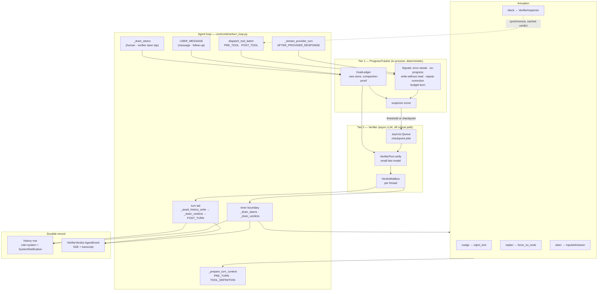

# Background Verifier Agent — Design

**Status:** Phase 1 done on `feat/verifier-agent`. Next work is **Phase 2 — Tracker, observe-only**.  
**Branch:** `feat/verifier-agent` — all phases commit here; no phase gets its own branch; do not push unless asked  
**Audience:** MonkeyBot harness maintainers  
**Related:** [Features & Design Reference](features.md) · `core/hooks/` · `core/runtime/turn_loop.py` · `core/knowledge/evidence_guard.py` · [live-evals.md](live-evals.md) · [smoke baseline](../evals/baselines/smoke.md)  
**Depends on:** goal ledger (landed), `SystemNotification` wire type extension (frontend contract — Phase 3)  
**Spiked:** 2026-09-04 — compaction split accounting; `role="system"` persistence across HistoryStore backends (see Part 4)  
**Reviewed:** 2026-09-04 — line references re-verified against `develop`; fixes folded in for the end-of-turn commit boundary, the steer tap, provenance of follow-ups/steers, the structured constraint schema, `USER_MESSAGE` settlement latency, config gating, and realtime-loop scope; Phase 0 (measurement harness) added to the build order  
**Phase 0 landed:** 2026-09-05 — commits `024314a` (docs) and `cb5c8a6` (harness + baseline)  
**Phase 1 landed:** 2026-09-05 — goal ledger store, classifier worker, USER_MESSAGE + steer taps, ResolvedIntent for compaction and subagents

---

## Progress / handoff

A new session should read this section, then Part 8 Phase 2, then Part 2 (tracker). Do not re-do Phase 0 or Phase 1.

| Phase | State |
|---|---|
| **0 — Measurement harness** | **Done.** Typed YAML-only `verifier:` parser, eval verdict capture, assertion keys, drift suite, `max_verdicts: 0` on smoke, pre-verifier live baseline committed. |
| **1 — Goal ledger** | **Done.** `GoalLedgerStore` + SQLite, `USER_MESSAGE` + steer tap, typed `Constraint` classifier, `ResolvedIntent` into compaction and subagent context. Defaults still off. |
| **2 — Tracker, observe-only** | **Next.** `ProgressTracker` on write-side hooks, `VerifierVerdict` at severity `none`. Cold-state rule: no record → no signal. |
| 3 — Durable record | Not started. |
| 4–6 — `nudge` / `replan` / `block` | Not started. |

**Constraints for whoever picks this up:**

- Config is **YAML-only**. No `ENV_MAP` / `ENV_SPEC` / new env vars for `verifier:`. `MONKEYBOT_CONFIG` is a bootstrap pointer (allowed) for pairing `monkeybot.yaml` vs `monkeybot.verifier-on.yaml`.
- Defaults stay **off**. Do not wire a `build_verifier` live slice until there is a consumer (Phase 1+). The parser and snapshot field already exist.
- Smoke fixture model is `ollama-cloud` / `glm-5.3-flash` (`OLLAMA_API_KEY`). Local scorecard uses `JUDGE_PROVIDER=fake` — deepeval's GPTModel against Ollama Cloud timed out with no scores. Do not add `--require-baseline` to `.github/workflows/live-eval-smoke.yml` until CI uses the same provider (it still expects `NVIDIA_API_KEY`; this baseline's `$0` cost is unpriced GLM).
- Do not commit `evals/smoke_agent/memory/` or workspace `notes/` / `scratch/` left by live runs.

**Phase 0 left in the tree (do not recreate):**

- Parser: `VerifierConfig` in `src/monkeybot/core/config/settings.py`; `RuntimeConfig.verifier`; `VERIFIER_DIFF_KEY` + `REBUILD` bump. Tests in `tests/core/test_config_extensions.py` and `test_runtime_config_snapshot.py`.
- Live evals: `VerdictRecord` / `TurnResult.verdicts` / `path_args` in `evals/models.py` + `evals/runner.py`; assertions in `evals/assertions.py`; nested `verifier_off` / `verifier_on` via `EVAL_VERIFIER_MODE`.
- Deterministic: `system_prompt_contains_once`, `tools_empty_on_turn` in `tests/evals/scenario_runner.py`.
- Drift suite: `evals/scenarios/drift/*.yaml`, `evals/suites/drift.yaml` (not in smoke), `evals/smoke_agent/monkeybot_config/monkeybot.verifier-on.yaml`. Recipe in [live-evals.md](live-evals.md).
- Baseline: [evals/baselines/smoke.json](../evals/baselines/smoke.json) / [smoke.md](../evals/baselines/smoke.md) — 11/11, `glm-5.3-flash`, judge skipped.

**Phase 1 left in the tree (do not recreate):**

- Types + stores: `src/monkeybot/core/persistence/goal_ledger.py`; DDL in `sqlite.py`; `StorageBackend.goal_ledger()`.
- Worker: `src/monkeybot/core/verifier/` (`GoalLedger`, `ProviderClassifier`). Hook only enqueues.
- Taps: `HookEvent.USER_MESSAGE` + `_drain_steers` (provenance on `SteerItem`).
- `ResolvedIntent` into compaction (`_summarize_history` `intent_facts`) and `SubagentEnvelope.context`.
- Gateway: `GatewayRuntime.build_verifier` when `verifier.enabled` and `ledger.enabled`.
- Tests: `tests/core/test_goal_ledger.py`.

**Not Phase 0 (still Phase 2+):** running smoke with `verifier.enabled: true` and expecting zero *emitted* verdicts — there is no emitter yet. `max_verdicts: 0` is already pinned on every smoke scenario so that run is an assertion, not a one-off.

---

## Scope

This design targets the **text agent loop** (`core/runtime/turn_loop.py` via `loop.py`). The realtime loop (`core/runtime/realtime_loop.py`) is **out of scope for every phase below**: it fires its own `PRE_TOOL` / `POST_TOOL` / `USER_MESSAGE` hooks, has no doom tracker, no steer drain, and no per-turn system message, and actuates only by appending to `inject_texts_out` for the gateway to push into the live session. Tier 1 observation could attach there later, but every actuation lever in Part 5 would need a realtime-specific equivalent. Do not wire the verifier into `realtime_loop.py` without a separate design note.

---

## Summary

The harness constrains *what* the main agent may do (command allowlist, permission DSL, doom-loop detection) but never checks *whether it is still doing what the user asked*. Add a background verifier that observes the agent as it works and course-corrects it.

Three decisions define the design:

- **Two tiers, not one agent.** A deterministic in-loop `ProgressTracker` (microseconds, no LLM) computes suspicion; an async LLM `Verifier` renders verdicts only at checkpoints. Most drift is detectable without a model, and an LLM on every tool call doubles cost for little marginal signal.
- **Verification requires a contract.** "Is the agent on track?" is unfalsifiable without a reference. A **goal ledger** — typed, provenance-tagged, stored outside history — is the reference. It spans multiple user messages so the verifier understands *why* the agent is doing something that looks off-task.
- **Async compute, synchronous commit.** The judge runs off the critical path and deposits verdicts in a mailbox; the **loop** commits them at a known boundary. Verdicts are durable in history via `SystemNotification`, which is persisted but stripped before the provider — so durability costs zero prompt tokens.

**Ship rule:** Tier 1 ships alone if its deterministic signals catch real drift in production sessions. Tier 2 is justified only where it beats Tier 1 on cost-adjusted precision. Every tier defaults off and fails open.

---

## Problem statement

Today's guardrails are all **local and negative** — they answer "is this specific action forbidden?" Nothing answers the **global and positive** question: "does the trajectory still serve the request?"

Concretely, the harness cannot currently detect:

| Failure | Why existing guards miss it |
|---|---|
| Agent solves an adjacent, easier problem | Every individual tool call is permitted |
| Agent abandons a constraint stated 3 messages ago | Constraints aren't tracked as state |
| Agent thrashes across *different* tool calls | `_DoomLoopTracker` only catches *identical* repeated calls |
| Agent declares success without meeting done-criteria | No done-criteria exist as data |
| Agent re-touches a file the user twice told it to leave alone | Corrections aren't tracked as state |

The last two are the highest-value targets and both require durable state the harness does not keep.

---

## Existing seams

The harness already provides everything needed. Four seams, in increasing order of power.

### 1. Observation — write-side hooks

`HookEvent.POST_TOOL`, `POST_TURN`, and `AFTER_PROVIDER_RESPONSE` fire as background tasks (`timeout_s == 0`) with return values ignored. They see tool names, args, results, errors, assistant text, thinking text, and token usage. This is the tap. `USER_MESSAGE` is also fired with `timeout_s=0` at `turn_loop.py:1358-1364`, despite the `HookEvent` docstring grouping it with the read-side events — but every fire-and-forget task is awaited (up to 2 s) by the settlement barrier before the next provider call, so "background" does not mean "free" (Part 1, Maintenance).

### 2. Soft injection — read-side hooks

Read-side hooks may set `payload.inject_text`, which the loop folds into the next provider call's system message:

**`src/monkeybot/core/runtime/turn_loop.py:341-346`**

```python
    system = _system_message_from_text(state.admit.leading_system_text)
    combined_extra = _combine_extras(state.pre_turn_extra, state.pre_tool_extra_next)
    force_no_tools, doom_loop_note = state.doom_tracker.consume_recovery()
    combined_extra = _combine_extras(combined_extra, doom_loop_note)
    state.system = _append_extra_system_text(system, combined_extra)
    state.pre_tool_extra_next = None
    state.turn_tools = () if force_no_tools else state.ctx.tools
```

Two constraints follow directly from this code:

- `PRE_TURN` fires only when `state.turn_index == 1` (`turn_loop.py:311`) — it is once-per-user-message, not once-per-inner-turn.
- `state.pre_turn_extra` is **never cleared**, so a `PRE_TURN` injection repeats on every subsequent inner turn. `pre_tool_extra_next` **is** cleared.

**Therefore all one-shot verifier corrections must inject via `PRE_TOOL`.** This is exactly why `EvidencePathGuard` registers both hooks.

### 3. Hard intervention — forced re-plan

`_DoomLoopTracker` demonstrates the strongest in-loop lever: `force_no_tools = True` plus a recovery note strips the tool list for one turn, so the model physically cannot act and must produce text. This primitive is already built and load-bearing; the verifier should reuse it rather than invent a second mechanism.

### 4. Blocking — inspectors

Inspectors are the only truly **synchronous** gate, running before tool execution and returning `allow` / `deny` / `confirm`, where `confirm` suspends on a future until a human answers over SSE (`tool_dispatch.py` `_resolve_inspector_decision`). Chain assembly is `GatewayRuntime.build_inspectors()` in `gateway/sse/app.py`.

### Prior art in-tree

`core/knowledge/evidence_guard.py` is a working single-purpose verifier and the structural template for this feature. It observes `AFTER_PROVIDER_RESPONSE` and `POST_TOOL`, keeps per-thread state in a bounded `OrderedDict` (`_THREAD_STATE_CAP = 256`, because one gateway process shares one guard across concurrent SSE sessions), queues a pending correction, and injects on `PRE_TURN` / `PRE_TOOL`. **Follow this shape.**

---

## System overview



---

## Part 1 — The goal ledger

### Why not "the last N user messages"

Three facts in the codebase make a rolling window of user messages the wrong unit.

**`role="user"` does not mean "a human said this."** Tool results are appended as user rows:

**`src/monkeybot/core/runtime/history_compaction.py:289-293`**

```python
    trimmed, needs_compaction = budgeter.fit_content_blocks(chunk_responses)
    await history.append(
        ctx.thread_id,
        Message(role="user", content=trimmed),
    )
```

So are compaction summaries, distinguished only by a `[Context Summary]:` text prefix. Add verifier steers, and the user role becomes "everything that isn't the assistant." A verifier scanning user rows for intent reads the summarizer's paraphrase and its own past corrections as human intent — it validates the agent against goals it invented itself.

Note the converse trap: **human input arrives through three paths, not one.** The typed message that starts a turn, a *steer* the human injects mid-turn (`InputAdmission.enqueue_steer`, drained and persisted as a user row at `turn_loop.py:219`), and a *follow-up* the human queues while a turn is running (`InputAdmission.enqueue_follow_up`, dequeued by `gateway/sse/routes.py:221` and re-entered as an ordinary turn). All three are human intent. A ledger that only listens to the first path misses exactly the mid-task corrections it exists to capture.

**Compaction destroys the middle of the conversation.**

**`src/monkeybot/core/runtime/history_compaction.py:49-54`**

```python
# Always keep the oldest row (usually the original user goal).
SUMMARY_KEEP_HEAD_COUNT = 1
# Keep newest rows until they consume this fraction of the model context window.
SUMMARY_KEEP_TAIL_RATIO = 0.20
# Floor so a user/assistant (or tool) pair survives even on tiny windows.
SUMMARY_KEEP_TAIL_MIN = 2
```

User messages 2 through N-3 stop existing as verbatim text in long sessions — exactly the sessions where drift matters most. **Any verifier that reads goal state out of history degrades precisely when it is most needed.**

**Most user messages aren't goals.** They are refinements, scope changes, corrections, answers to the agent's own questions, or noise. Accumulated flat, the verifier will flag the agent for abandoning a goal the user themselves withdrew.

### Data model

Stored in a dedicated `GoalLedgerStore` (protocol + SQLite implementation first), following the pattern of `ScheduledLoopStore` and `SQLiteRunStore` rather than extending all three `HistoryStore` backends.

```python
class Provenance(StrEnum):
    HUMAN = "human"                  # typed message, human steer, human follow-up.
                                     # ONLY this provenance derives intent.
    VERIFIER_STEER = "verifier_steer"
    CONTEXT_SUMMARY = "context_summary"
    TOOL_RESULT = "tool_result"      # role="user" rows appended by the tool batch

class Channel(StrEnum):
    MESSAGE = "message"              # started the turn (USER_MESSAGE hook)
    STEER = "steer"                  # admitted mid-turn via _drain_steers
    FOLLOW_UP = "follow_up"          # queued during a turn, re-entered as a new turn

class Intent(StrEnum):
    NEW_GOAL = "new_goal"
    REFINEMENT = "refinement"        # narrows the active goal
    SCOPE_CHANGE = "scope_change"    # supersedes it
    CORRECTION = "correction"        # "no, not that"
    PREEMPT = "preempt"              # "do X first" → defers, does not abandon
    ANSWER = "answer"                # replies to the agent's question
    NOISE = "noise"

class Status(StrEnum):
    ACTIVE = "active"
    DEFERRED = "deferred"
    SATISFIED = "satisfied"
    SUPERSEDED = "superseded"
    ABANDONED = "abandoned"

class ConstraintKind(StrEnum):
    PATH_GLOB = "path_glob"          # matched against path-like tool args
    TOOL_NAME = "tool_name"          # matched against the tool being called
    COMMAND_REGEX = "command_regex"  # matched against shell/command args
    FREE_TEXT = "free_text"          # NOT matchable in Tier 1; Tier 2 only

@dataclass(frozen=True)
class Constraint:
    kind: ConstraintKind
    pattern: str                     # glob / name / regex / prose per kind
    source_entry_id: str
    verbatim: str                    # the user's words, for rationale text

@dataclass(frozen=True)
class GoalEntry:
    entry_id: str
    thread_id: str
    seq: int
    verbatim: str
    provenance: Provenance
    channel: Channel | None           # set for HUMAN; None otherwise
    intent: Intent
    status: Status
    relates_to: str | None            # entry this supersedes / refines / defers
    constraints: tuple[Constraint, ...]   # sticky; survives goal changes
    done_when: tuple[str, ...]
    created_at_ms: int
```

**Provenance is tagged at write time, never inferred from role.** This single rule closes the self-confirmation loop in which the verifier's own steers become the goal it verifies against. `Channel` is bookkeeping, not a trust boundary: a human steer and a human follow-up are `HUMAN` and derive intent exactly like a typed message. The write-time tag is what distinguishes a human steer from a `VERIFIER_STEER` that travelled through the same `InputAdmission` queue.

**Constraints are structured, not prose.** The two Tier 1 signals that justify the ledger (`constraint_touch`, `repeat_correction`, Part 2) intersect tool arguments with constraints *deterministically*. "Don't touch the migration files" cannot be matched against `path="db/migrations/001.sql"` as free text; it can as `Constraint(kind=PATH_GLOB, pattern="db/migrations/**")`. The classifier must emit typed constraints, and anything it cannot type lands as `FREE_TEXT`, which Tier 1 ignores and only the Tier 2 judge sees. Measure the typed / free-text ratio from Phase 1; if most constraints come back untyped, the deterministic signals do not exist and Phase 2 should say so.

### Maintenance

On each **human** input, one small model call classifies it and its relation to currently-open entries — an O(1) incremental update, not a re-derivation. That classification step is where supersession is resolved: `PREEMPT` marks the open goal `DEFERRED`, `SCOPE_CHANGE` marks it `SUPERSEDED`.

**Two taps, not one.** Typed messages and follow-ups both start a turn and reach the ledger through `HookEvent.USER_MESSAGE` (`turn_loop.py:1358-1364`). Human steers do **not**: `_drain_steers` persists the steer as a user row and fires no hook. The ledger therefore needs a second tap inside `_drain_steers` — either a new `HookEvent.STEER_ADMITTED` fired with the steer content, or a direct call into the ledger from the drain. Whichever is chosen, the tap must carry an explicit `provenance` so a `VERIFIER_STEER` travelling through the same queue (Part 5) is tagged at write time rather than guessed.

**`USER_MESSAGE` is fire-and-forget, and that has a latency cost.** The `HookEvent` docstring groups `USER_MESSAGE` with the read-side events, but the call site fires it with `timeout_s=0`, so the hook is a background task with no 2-second cap. That is what makes a model call there possible at all. The catch is the settlement barrier:

**`src/monkeybot/core/runtime/turn_loop.py:1377-1379`**

```python
        # Settlement barrier: fire-and-forget hooks from the prior tool batch
        # must finish (or time out) before the next provider call.
        await _drain_hook_settlement(hook_manager)
```

`drain_settlement` awaits every pending fire-and-forget task for up to `_HOOK_SETTLEMENT_TIMEOUT_S` (2 s, defined in `core/runtime/loop_hooks.py`, not `core/hooks/__init__.py`) before **every** provider call. A classifier call that takes 3 s adds 2 s of latency to the first provider call on every user message, then logs a warning each time. Rule: **the hook only enqueues and returns.** The classifier runs in a task owned by the ledger (its own `asyncio.Queue` + per-thread worker), not tracked by `HookManager`. The same rule applies to the Tier 2 judge worker in Part 3.

Two consequences follow from running the classifier off the hook path:

- **The ledger may be stale when turn 1 begins.** `ResolvedIntent` carries a `pending_classification: bool` flag (or the `seq` of the newest classified entry) so Tier 1 and Tier 2 know the newest human input has not been folded in yet. Signals that depend on the ledger (`constraint_touch`, `repeat_correction`) evaluate against the *previous* resolved view and never block waiting for the new one.
- **Per-thread serialization.** Two human inputs in quick succession (a message and an immediate steer, or two rapid follow-ups) must be classified in `seq` order, since the second's `relates_to` edge depends on the first's outcome. One worker per thread, or a per-thread lock around the classify-and-write step.

Bound by tokens and lifecycle, not count: verbatim text for `ACTIVE` and recently-`DEFERRED` entries, compressed one-liners for `SATISFIED` and `SUPERSEDED`, and drop satisfied entries beyond an age cap unless they carry a still-live constraint. Per-thread in-memory state uses the bounded-`OrderedDict` LRU pattern from `EvidencePathGuard`; the store is authoritative and the LRU is a cache, so eviction or a gateway restart reloads rather than forgets.

### The resolved intent view

The verifier never sees raw entries. It receives a derived view:

```python
@dataclass(frozen=True)
class ResolvedIntent:
    active_goal: GoalEntry | None
    refinement_chain: tuple[GoalEntry, ...]   # how the active goal got here
    deferred_stack: tuple[GoalEntry, ...]     # why off-task work may be legitimate
    superseded: tuple[str, ...]               # compressed
    standing_constraints: tuple[Constraint, ...]   # accumulated across ALL entries
    correction_history: Mapping[Constraint, int]   # constraint → times user pushed back
    pending_classification: bool              # newest human input not yet folded in
```

Two capabilities the multi-message view unlocks that a single-message contract cannot express:

- **`deferred_stack` prevents the dominant false positive.** An agent working a prerequisite looks like drift against a single goal; against the ledger, the verifier can see the user themselves redirected it.
- **`correction_history` is the strongest available drift signal and needs no LLM.** If the user has pushed back on a typed constraint twice and the agent's tool args match it again, that is high-confidence drift computable entirely in Tier 1. It is keyed by `Constraint`, not by prose, for exactly that reason.

`standing_constraints` matters because constraints are sticky in a way goals are not — "don't touch the migration files" survives a scope change, and is both the most commonly violated and the least likely to appear in the latest message.

### Deliberate side benefit: feed compaction

Compaction already derives nearly this artifact, independently, from a possibly-truncated middle segment:

**`src/monkeybot/core/runtime/history_compaction.py:61-68`** — the `_COMPACTION_SUMMARY_SYSTEM` template

```text
## Objective
- [one or two brief sentences describing what the user is trying to accomplish]

## Important Details
- [constraints/preferences, decisions and why, important facts/assumptions, \
exact context needed to continue, or "(none)"]
- [answer-format / output contract from the user, verbatim when present \
(e.g. `Qxx:` / `Evidence:` lines); otherwise omit this bullet]
```

Two subsystems deriving the same artifact from the same data will drift apart. Make the ledger **authoritative and upstream**, and have compaction *consume* `ResolvedIntent` as given input instead of re-inferring it. This makes compaction strictly more faithful and removes a real source of long-session intent decay that exists today, independent of verification.

This is an **additive input, not a replacement**. The ledger defaults off and fails open, so compaction must keep today's template and behaviour whenever no `ResolvedIntent` is available for the thread (ledger disabled, store unreachable, or `pending_classification` with no prior view). When a view *is* available, it is passed to the summarizer as given facts for the `## Objective` and `## Important Details` sections, and the summarizer is told not to contradict it.

The same view is the right payload for a subagent's `context` field in `SubagentEnvelope` — children currently get no view of standing constraints.

---

## Part 2 — Tier 1: the progress tracker

In-process, deterministic, no model calls. Registered on the write-side hooks. It computes **suspicion, not verdicts**.

Per-thread record: files read vs written, tool-call histogram, consecutive-error streak, wall-clock and token spend against the turn cap, repeated-argument patterns, and turns elapsed since the last user-facing assistant text.

Signals worth implementing first, all cheap and all high-precision:

| Signal | Fires when |
|---|---|
| `error_streak` | ≥3 consecutive tool errors |
| `no_progress` | ≥N inner turns of tool calls with no assistant text |
| `write_without_read` | Mutation of a file never read or globbed this session |
| `repeat_correction` | Tool args match a `Constraint` with `correction_history[c] ≥ 2` |
| `constraint_touch` | Tool args match any typed `Constraint` in `standing_constraints` |
| `budget_burn` | Token spend crosses a fraction of the turn cap |
| `rewrite_churn` | Same file rewritten ≥N times |

`repeat_correction` and `constraint_touch` are the two that only exist because of the ledger, and are the two most likely to justify the whole feature. Both match only against **typed** constraints (`PATH_GLOB` → path-like args, `TOOL_NAME` → the call name, `COMMAND_REGEX` → shell/command args). `FREE_TEXT` constraints never fire a Tier 1 signal.

**Tracker state is process-local and cold after restart.** The per-thread record (files read, histogram, streaks) lives in the same bounded LRU as `EvidencePathGuard` and is lost on gateway restart or eviction. Every signal that depends on accumulated session state — `write_without_read`, `rewrite_churn`, `no_progress` — must treat "no record for this thread" as **no signal**, never as "nothing was read." Otherwise a restart mid-session makes every subsequent write look suspicious, in exactly the long sessions this feature targets. Signals derived from the ledger store (`constraint_touch`, `repeat_correction`) survive restarts because the store does.

---

## Part 3 — Tier 2: the async verifier

### Contract

```python
@dataclass(frozen=True)
class Verdict:
    verdict_id: str
    checkpoint_id: str
    status: Literal["on_track", "drifting", "off_track", "stuck", "done"]
    severity: Literal["none", "nudge", "replan", "steer", "block"]
    confidence: float
    rationale: str
    correction: str | None
    triggering_signals: tuple[str, ...]

class VerifierPort(Protocol):
    async def verify(
        self, intent: ResolvedIntent, evidence: EvidenceBundle
    ) -> Verdict: ...
```

Making this a `Protocol` is load-bearing for testability: it lets the deterministic scenario runner in `tests/evals/` stub verdicts and assert on **the loop's reaction to a verdict**, independently of whether any real model produces that verdict. Without it, the entire feature is only testable against live models.

### Why it must be async

Read-side hooks block the loop and are bounded at 2 seconds:

**`src/monkeybot/core/hooks/__init__.py:215-224`**

```python
    @staticmethod
    async def _run_one(fn: HookFn, payload: HookPayload, timeout_s: float) -> None:
        try:
            await asyncio.wait_for(fn(payload), timeout=timeout_s)
        except asyncio.TimeoutError:
            _log.warning(
                "hook timed out event=%s fn=%s timeout_s=%.2f",
```

An LLM verdict takes seconds. The tracker enqueues a job onto an `asyncio.Queue` and returns immediately; a per-session worker drains it, calls the model, and deposits the verdict into a mailbox. The worker is a task owned by the verifier, **not** a `HookManager`-tracked task — otherwise the 2-second settlement barrier before every provider call (Part 1, Maintenance) would wait on it. **Consequence: verdicts land one step late.** That is acceptable for course-correction and unacceptable for prevention — which is why irreversible actions are gated by the synchronous inspector reading *cached* verdict state (see escalation level 4), not by waiting on the judge.

### Trigger policy

Checkpoint, don't stream. Verify after a file-mutating tool batch, at inner-turn boundaries past turn 3, when suspicion crosses threshold, when `_DoomLoopTracker` triggers, when token spend crosses a budget threshold, and before any tool the permission DSL classifies as destructive.

Then rate-limit hard: minimum turns between verdicts, a cap per user message, and a maximum verifier spend as a fraction of the main agent's. **Log that ratio from day one** — "the verifier cost more than the agent" is the most likely reason this gets switched off.

Suppress all verdicts before turn 3. Early wandering is how agents find things.

---

## Part 4 — Durability: async compute, synchronous commit

### The vehicle

`SystemNotification` is persisted like any other content block but stripped before the provider sees it:

**`src/monkeybot/core/messages/transform_context.py:31-37`**

```python
_PROVIDER_EXCLUDED_BLOCKS: tuple[type[ContentBlock], ...] = (
    AttachmentDescriptor,
    ToolConfirmationRequest,
    FrontendToolRequest,
    ActionRequired,
    SystemNotification,
)
```

A row whose blocks are entirely provider-excluded is dropped whole, with adjacency fallout already handled by `_coalesce_adjacent_same_role`:

**`src/monkeybot/core/messages/transform_context.py:43-49`**

```python
        kept = [b for b in msg.content if not isinstance(b, _PROVIDER_EXCLUDED_BLOCKS)]
        if not kept and msg.content:
            logger.debug(
                "transform_context drop_ui_only_turn %s",
                kv(action="drop_ui_only_turn", role=msg.role, blocks=len(msg.content)),
            )
            continue
```

So durability and actuation need not trade off. The same verdict gets two representations:

- **The record** — a `SystemNotification` block on a `role="system"` row. Durable, survives reload, replays in the transcript, renders in the UI, costs **zero prompt tokens**. `system` is a legal role (`Message.__post_init__` validates against `("user", "assistant", "system")`), so there is no provenance lie of the kind the ledger exists to avoid.
- **The correction** — ephemeral `inject_text` / `force_no_tools` / steer, re-derived from the still-open record each time it is needed.

A verdict the agent already acted on therefore does not sit in the prompt re-criticizing it forever, while the audit trail is permanent.

### The ordering hazard

The verifier finishes at an unpredictable moment and history is append-position-ordered. A direct background append lands wherever it happens to land — possibly interleaved into a tool batch's settlement, after `TurnComplete`, or mid-compaction, which computes a head/middle/tail split and then rewrites. An append racing that split is swallowed into the summarized middle or lands after the boundary was computed: lost or duplicated, nondeterministically.

The codebase already knows this failure class and its fix:

**`src/monkeybot/core/runtime/history_compaction.py:116-122`**

```python
async def _await_history_write(task: asyncio.Task[None] | None) -> None:
    """Await a backgrounded history write, logging (never raising) on failure.

    The final assistant message is persisted off the token-streaming path, but it
    MUST land before any later ``history.load``/``reset`` (e.g. attachment freeze)
    so the row is not lost. Callers await this at the turn tail.
    """
```

**The verifier task never touches `history`.** It writes to a mailbox; the loop drains and commits at the same safe boundary where steers already drain. Commit position becomes a function of loop position rather than wall-clock latency — deterministic, replay-faithful, and testable.

```python
async def _drain_verdicts(
    *,
    verifier: VerdictMailbox | None,
    history: HistoryStore,
    ctx: TurnContext,
) -> AsyncIterator[AgentEvent]:
    """Commit completed verdicts at a safe boundary; never blocks on the judge."""
    if verifier is None:
        return
    for verdict in verifier.take_ready(ctx.thread_id):   # non-blocking
        await persist_message(
            history,
            Message(role="system", content=[SystemNotification(
                notification_type="verifierVerdict",
                msg=verdict.rationale,
                data=verdict.to_wire(),
            )]),
            thread_id=ctx.thread_id,
            turn_id=ctx.request_id,
            memory=ctx.memory,
            ingest=False,
        )
        yield VerifierVerdictEvent(request_id=ctx.request_id, ...)
```

`take_ready` **must be non-blocking**. If the judge has not finished, the verdict lands at the next boundary. The loop never waits on the verifier — this is what makes the feature safe to leave enabled.

### Two call sites, not one

**Inner-turn boundary.** Alongside `_drain_steers` in the inner-turn preamble (`turn_loop.py:1372`). This is the steady-state boundary and catches every verdict that completes while the agent is still working.

**Turn tail.** The inner boundary alone has a hole. Once the model emits final text the `while` loop exits, and the tail runs, in order: `_await_history_write` (`turn_loop.py:1504`), `freeze_attachments_in_history` (`:1506`), `POST_TURN` (`:1521`), then `loop.py`'s `finally` drains hook settlement and yields `TurnComplete`. Nothing in that path drains the mailbox. Any verdict that completes after the last inner boundary — which is *every* verdict triggered by the final tool batch or by the final assistant text — would otherwise land at the **next** user message's first inner turn: positioned after the new user row, stamped with the new `request_id`, and attributed in the transcript to a turn it did not judge.

That hole swallows the single most valuable verdict. "Agent declares success without meeting done-criteria" (Problem statement) is a `status="done"` judgement that can only fire once the agent has stopped, i.e. exactly at the turn tail.

So `_drain_verdicts` runs a second time in the turn tail, **after** `_await_history_write` (so the assistant row is durable and the verdict lands after it) and **before** `POST_TURN`. This tail drain is the one place the loop is permitted to *wait* on the judge, and only for a bounded grace period:

```python
    await _await_history_write(state.assistant_write_task)
    async for evt in _drain_verdicts(
        verifier=verifier, history=history, ctx=state.ctx,
        grace_s=_verdict_tail_grace_s(),   # default 0.0 in Phases 3–4
    ):
        yield evt
```

With `grace_s=0` the tail drain is identical to the inner one: commit whatever is ready, never block. Raising it (config `judge.tail_grace_s`) lets a nearly-finished `done` verdict land in the right turn at the cost of delaying `TurnComplete` by up to that many seconds. Anything still not ready after the grace period is **dropped from the mailbox, not deferred**, and recorded in the verifier's own store as `stale`; it must not leak into the next turn's history. Ship with `0.0`, measure how often `done` verdicts miss, then decide whether a small grace is worth the latency.

### Verdict lifecycle is event-sourced, not mutated

A verdict has state — open, acknowledged, resolved, stale — and history rows are immutable. Keep authoritative mutable state in the verifier's own store beside the ledger, and treat history rows as an immutable event log: one row for "verdict issued", a later row for "verdict resolved", correlated by `verdict_id`. The UI folds the pair into one resolved item. This fits append-only history naturally.

### Four integration requirements

1. **`ingest=False`** on the persist call. `persist_message` enqueues a memory outbox row when ingest is set; verdicts must not enter long-term memory, or "the agent went off track" resurfaces as retrieved context in unrelated future sessions — wrong and self-reinforcing.
2. **`SystemNotificationType` is a closed literal** (`"thinkingMessage" | "inlineMessage" | "creditsExhausted"`, `src/monkeybot/core/types/content_blocks.py:253`). Adding `"verifierVerdict"` is a wire-schema change the `monkeyapp` frontend must learn. This is the one genuine cross-repo cost of this vehicle. **Deploy the type extension before the first write** — SQLite/Postgres `history.load` raises on an unknown `notificationType`; Firestore skips the unparseable row. A mixed-version gateway would otherwise fail the whole thread (SQL) or silently drop the audit row (Firestore).
3. **Add `VerifierVerdict` to `DURABLE_EVENT_KINDS`** (`runtime/events.py:416`), following the existing convention of naming the history mirror in a comment — here, the `SystemNotification` block. Keep it **out** of `SUBAGENT_FORWARD_KINDS`; subagent loops run with `hook_manager=None` (the `loop.py:73` default — nothing in `core/subagents/` passes one), so no hooks fire and children produce no verdicts.
4. **Pin provider-excluded rows across compaction.** Do **not** treat this as a token-budget problem (see spike below). The real bug is durability: `split_messages_for_compaction` + `history.reset` flatten middle `SystemNotification` rows into `system: [SystemNotification]` text on an assistant summary. Splice those rows back after reset, in original relative order, and exclude them from head/middle/tail *row* accounting so they cannot occupy `SUMMARY_KEEP_TAIL_MIN`.

### Spike findings (2026-09-04)

Two assumptions in the first draft were left unverified. Both were spiked against current `main` code (and, for compaction, against `split_messages_for_compaction` with live `SystemNotification` rows).

#### Assumption A — compaction split vs. provider-excluded rows

**Original worry:** if the split counts raw rows, verdicts consume tail budget for content the model never sees, making compaction fire earlier.

**Finding: the trigger is unaffected; the durability path is not.**

Compaction *fires* from `ContextBudgeter.fit_content_blocks` when remaining window is exhausted. That `used_tokens` comes from `_load_agent_chat_history` → `transform_context`, which already drops `SystemNotification` (and entire UI-only turns). A verdict row is invisible to the provider preflight, so it **does not make compaction fire earlier**. Confirmed: `transform_context` of a 21-row transcript that includes one verdict returns 20 rows.

The split itself (`history_compaction.py:172-206`) runs on **raw** `history.load()` rows, with no `transform_context`. `_raw_block_char_count` has no `SystemNotification` arm, so a verdict falls through to `len("SystemNotification")` = 18 chars → **4 tokens**. Against `SUMMARY_KEEP_TAIL_RATIO` (20% of the window) that is noise, not pressure.

What *does* happen, measured on a 20-row transcript at `window_tokens=100` (the same tiny-window case as `test_split_keeps_minimum_tail_on_tiny_window`):

| Setup | head / middle / tail | Verdict location | Side effect |
|---|---|---|---|
| Baseline | 1 / 17 / 2 | — | tail = last user + last assistant |
| Newest row is a verdict | 1 / 18 / 2 | **tail** | displaces the previous user row from the protected floor into middle |
| Verdict inserted at index 5 | 1 / 18 / 2 | **middle** | `_summary_line_for_message` renders `system: [SystemNotification]`; `history.reset` **destroys the typed block** |

So the original "earlier compaction" assumption is **false**. The change we still need in Phase 3 is different: **pin** provider-excluded / `role="system"` notification rows, exclude them from the split's row and token accounting, and splice them back after reset. Otherwise:

- under context pressure, a just-committed verdict steals one of the two protected tail slots and pushes a real user/tool row into the summarizer;
- any verdict older than the tail is flattened and the UI/event-log record is gone, even though the ledger store still has mutable state.

`transform_context` already coalesces roles after dropping UI-only turns (`test_transform_drops_ui_only_turns`, `test_transform_coalesces_roles_after_dropping_interior_ui_only_turn`), so the provider path stays valid either way.

#### Assumption B — `role="system"` on all HistoryStore backends

**Original worry:** `Message` allows `"system"`, but maybe one of SQLite / Postgres / Firestore rejects it on append or load.

**Finding: all three backends accept it.** There is no SQL `CHECK` on `role` — the column is `TEXT NOT NULL` in SQLite (`sqlite.py:119`) and Postgres (`postgres.py:64`). Validation is application-level and identical:

```python
_VALID_ROLES: tuple[str, ...] = ("user", "assistant", "system")
```

in `persistence/history.py:31`, `postgres.py:58`, and `firestore.py:53`. `append` / `_insert_message` / `load` all reject anything outside that set. `history.reset` re-inserts through the same validator, so a compaction rewrite of a system row is legal.

Live SQLite roundtrip (in-memory `SQLiteHistoryStore`): `append` of `role="system"` + `SystemNotification(notification_type="inlineMessage", …)`, `load`, and `reset` all succeed; the typed block and `data` dict survive. Postgres and Firestore were not live-roundtripped (no credentials in this spike); their insert/load/reset paths copy the same `_VALID_ROLES` + `ContentBlock.from_dict` reconstruction, so the contract is the same. Firestore is the soft one: unparseable rows are **skipped** (`firestore.py:414-421`) rather than failing the load.

Production today **never persists** `role="system"` — `_system_message_from_text` in `loop_messages.py` is in-memory prompt construction only. Tests that construct `role="system"` (`test_loop.py`, `test_provider_contract.py`) never go through `HistoryStore.append`. Verdict rows would be the first durable system messages; Phase 3 should add an explicit append/load/reset test on SQLite (and the postgres/firestore test doubles if they exist) so that stays true.

**Wire-type caveat, confirmed:** `ContentBlock.from_dict({"type": "systemNotification", "notificationType": "verifierVerdict", ...})` raises `ValueError: SystemNotification: invalid notificationType: 'verifierVerdict'` (`core/types/content_blocks.py:185-186`). Do not write that tag until the literal is extended. Until then, Phase 3 can persist as `inlineMessage` plus a `data.kind = "verifierVerdict"` discriminator — uglier, but load-safe on mixed versions. Prefer extending the literal in the same change as the first write.

---

## Part 5 — Escalation ladder

Map `Verdict.severity` onto levers the harness already has, weakest first. The verifier must never jump straight to the strong ones.

| Severity | Mechanism | Properties |
|---|---|---|
| `none` | Record + event only | Observability; no behavioral effect |
| `nudge` | `inject_text` on next `PRE_TOOL` | Ephemeral, cheapest, model may ignore — correct for low confidence |
| `replan` | `force_no_tools` + note, via the doom-loop primitive | Model cannot act, must restate plan. Sweet spot for genuine drift |
| `steer` | `InputAdmission.enqueue_steer()` | Persisted as a user row; survives compaction; carries user-level authority |
| `block` | `VerifierInspector` reading cached verdict state | Synchronous `deny` / `confirm`. Solves "one step late" for irreversible actions |
| — | `ToolConfirmationRequest` to a human | Escalate; the verifier never unilaterally cancels |

Note on `steer`: it persists as `role="user"`:

**`src/monkeybot/core/runtime/turn_loop.py:206-212`**

```python
async def _drain_steers(
    *,
    input_admission: InputAdmission | None,
    history: HistoryStore,
    ctx: TurnContext,
) -> AsyncIterator[AgentEvent]:
    """Inject queued steer messages at a safe boundary (before next provider call)."""
```

Writing verifier output as a user message is a provenance lie the agent will treat as gospel. If this level is used, prefix the content so it is unmistakably machine-generated, and tag the resulting ledger entry `Provenance.VERIFIER_STEER` through the steer tap (Part 1, Maintenance) so it is excluded from intent derivation. Because human steers travel through the same queue, the tap must receive provenance explicitly from the enqueuer; it cannot be inferred from the content.

`enqueue_steer` raises `AdmissionQueueFullError` at capacity (and `ValueError` on empty content). The verifier catches both, logs at WARNING, and downgrades the verdict to `replan` for that checkpoint. A full steer queue means the human is already steering; the verifier must not compete with them.

`block` is what makes async latency tolerable: the inspector performs a synchronous read of precomputed state, so the verifier does not need to be fast — it needs to have already marked a risk zone before the agent reaches the irreversible action.

---

## Part 6 — Failure modes to design against

**Oscillation.** Verifier says left, agent goes left, verifier reads the pivot as drift and says right. Make verdicts idempotent per `checkpoint_id`, require rising confidence to re-fire the same finding, and track whether the agent complied with the previous correction before issuing another.

**Supersession false positives.** The dominant failure mode. The user changes their mind and a correct verifier stays silent. Mitigated by `deferred_stack` and refinement edges; must be pinned by dedicated eval scenarios.

**False positives on legitimate exploration.** Suppress before turn 3; weight `no_progress` by elapsed turns rather than absolute counts.

**Context pollution.** Corrections consume context and raise compaction pressure. Keep them short; prefer ephemeral system-extra over durable-and-visible text. The `SystemNotification` choice eliminates the record's contribution to **provider** tokens (confirmed: `transform_context` drops it). It does **not** eliminate contribution to the compaction **split** until Phase 3 pins those rows — under a tight window a newest verdict currently displaces a real user row from the two-row protected tail.

**Split-brain authority.** The verifier's notion of correct behavior will drift from `AGENT.md` unless they share a source. Derive the verifier's prompt from the same agent config; do not write a second independent spec.

**Recursion / self-observation.** `_in_hook` blocks re-entrancy inside `fire()`, and subagent loops run with no hook manager. If Tier 2 is implemented via `spawn_subagent`, keep its `thread_id` out of the tracker.

**Missed human input.** The ledger hears typed messages and follow-ups via `USER_MESSAGE`, but human steers bypass that hook entirely. Without the steer tap in Part 1, a mid-turn "stop, leave the migrations alone" never becomes a `CORRECTION` entry, and the verifier stays silent on the one axis the user just flagged. The steer tap is a Phase 1 requirement, not a refinement.

**Latency leak through the settlement barrier.** Any model call that runs *inside* a fire-and-forget hook is awaited (up to 2 s) by `_drain_hook_settlement` before the next provider call. Both the ledger classifier and the Tier 2 judge must run in their own tasks, with the hook doing nothing but an enqueue. A test should assert that a slow stub classifier does not delay the first provider call (Part 9).

**Cold tracker state.** Process-local tracker state is lost on restart or LRU eviction. "No record for this thread" is no signal, never a positive signal (Part 2).

**Cost inversion.** Log verifier-spend / agent-spend from the first commit.

**Silent failure is mandatory.** Every hook in this codebase fails open and logs at WARNING. A verifier that can wedge a turn is strictly worse than no verifier.

---

## Part 7 — Configuration

New `verifier:` block in `monkeybot.yaml`, defaulted off. The section is **YAML-only**: every key is read from the merged config file, never from the environment, following `subagents:` and `realtime.model.*`. `test_env_map_three_way_exhaustiveness` only binds `ENV_MAP` values to `ENV_SPEC` keys — YAML keys that are not in `ENV_MAP` need no env var.

```yaml
verifier:
  enabled: false               # master switch; when false, NOTHING below runs
  ledger:
    enabled: false             # one classifier call per human input when on
    model: gemini-2.5-flash    # classifier; see Open decision 2
    max_entries_per_thread: 64
  tracker:
    enabled: false             # requires ledger.enabled for constraint signals
    suspicion_threshold: 3
    min_turn_before_verdict: 3
  judge:
    enabled: false             # requires tracker.enabled
    model: gemini-2.5-flash    # small + fast; not the main agent's model
    max_verdicts_per_message: 3
    min_turns_between_verdicts: 2
    max_spend_ratio: 0.25      # of main-agent tokens for this message
    tail_grace_s: 0.0          # bounded wait for a `done` verdict at turn tail
  escalation:
    max_severity: nudge        # nudge | replan | steer | block
```

**Gating is explicit and hierarchical.** `verifier.enabled: false` disables every child regardless of its own flag; that is the one switch an operator needs to turn the whole feature off. Within it, `ledger` can run alone (Phase 1 ships this way, as a compaction and subagent-context improvement); `tracker` without `ledger` runs only the ledger-independent signals (`error_streak`, `no_progress`, `write_without_read`, `budget_burn`, `rewrite_churn`); `judge` requires `tracker`. The ledger's default is `false` because it is the only sub-feature with a per-message model cost even when nothing is being verified.

**Plumbing is a typed snapshot field, not an env map.** Mirror `subagents:`:

- Nested frozen dataclasses in `core/config/settings.py` next to `SubagentSettings`, with `_verifier_section()` and `verifier_config_from_section()`.
- `_parse_verifier(merged)` called from `build_runtime_config()`; a `verifier: VerifierConfig` field on `RuntimeConfig` (`core/config/snapshot.py`).
- `VERIFIER_DIFF_KEY = "verifier.*"` in `core/config/runtime_env.py`, explicitly **not** in `ENV_MAP` / `ENV_SPEC`. Tests assert `("verifier", "enabled") not in ENV_MAP`.
- Typed comparison in `diff_runtime_configs()` plus an explicit `tiers.add(ConfigTier.REBUILD)` when the synthetic key is present — `ENV_TIERS` is keyed by env var name, so a YAML-only key would otherwise produce an empty `tiers` set and skip reload.
- A `build_verifier(cfg)` live slice triggered from `_rebuild_live_slices` in `gateway/sse/app.py`, using the pinned snapshot (not a later disk read). **Not wired yet** — Phase 0 shipped parser + snapshot only; wire this when Phase 1 has a consumer.

One synthetic key means the whole section is `REBUILD` (subagents' choice). Splitting HOT (flags, thresholds, `max_severity`) from REBUILD (model ids) would need two synthetic keys (`verifier.hot`, `verifier.rebuild`) with separate bumps. Start with one `REBUILD` key and split only if reload latency becomes a real complaint.

`validate_monkeybot_yaml_doc` has no unknown-section allowlist, so an unparsed `verifier:` block is silently ignored. The parser must land before any config-gated behaviour is trusted — that is why Phase 0 pulls the typed section forward rather than waiting for Phase 1.

`max_severity` is the primary safety valve: ship with `nudge` and raise it only once precision is measured.

---

## Part 8 — Build order

Each phase is independently shippable and independently reversible: **one commit per phase on `feat/verifier-agent`**, not one branch per phase. The branch is the unit of review for the whole feature.

**Phase 0 — Measurement harness. Done (2026-09-05).** Landed before any verifier loop code. Typed `verifier:` parser is live so a `verifier.enabled: true` YAML file is not a silently-ignored no-op. `build_verifier` is **not** wired — parser + snapshot only. Details and file pointers are in Progress / handoff above. Remaining Phase 0-shaped work that is *acceptance for a later phase*, not unfinished Phase 0:

- Zero-verdict smoke **with a real emitter** (`verifier.enabled: true`, `escalation.max_severity: none`, no verdicts, baseline gates green) is Phase 2 acceptance. `max_verdicts: 0` is already on every smoke scenario.
- Deterministic `verifier=None` vs stubbed `VerifierPort` pairs in `tests/evals/` are Phase 4+ (nothing to stub yet).

**Phase 1 — Goal ledger. Next.** `GoalLedgerStore` protocol + SQLite backend; `USER_MESSAGE` hook **and** the steer tap in `_drain_steers`; write-time provenance (`HUMAN` for message / steer / follow-up); the typed `Constraint` schema and a classifier prompt that emits it; classifier running in a ledger-owned per-thread worker (hook only enqueues); `ResolvedIntent` derivation with `pending_classification`. No verification yet. Independently valuable: feed `ResolvedIntent` into compaction as an additive input (current template stays the fallback) and into `SubagentEnvelope.context`. Log the typed / free-text constraint ratio.

**Phase 2 — Tracker, observe-only.** `ProgressTracker` on write-side hooks, `VerifierVerdict` event emitted at severity `none`, wired to logging and SSE only. Cold-state rule: no record → no signal. Acceptance: the Phase 0 zero-verdict smoke run is green (no verdicts, baseline gates hold), and the drift suite's `verifier_on` blocks show which deterministic signals fire on cases (a), (d), (e) while (b) and (c) stay silent. Then run over real sessions and measure. **This phase decides whether Tier 2 is needed at all.**

**Phase 3 — Durable record.** `SystemNotification` verdict rows; `_drain_verdicts` at **both** call sites (inner-turn preamble and turn tail after `_await_history_write`, `grace_s=0`); `DURABLE_EVENT_KINDS` entry; frontend wire type (`verifierVerdict`). Compaction: pin provider-excluded / system-notification rows, exclude them from split accounting, splice back after `history.reset` (the token-budget "fires earlier" worry is false; the durability-through-compaction hole is real). HistoryStore append/load/reset tests for `role="system"`. Still no behavioral intervention.

**Phase 4 — `nudge`.** Async `VerifierPort`, queue + mailbox with a verifier-owned worker (not `HookManager`-tracked), `PRE_TOOL` injection, rate limits, spend logging, `tail_grace_s` measurement for `done` verdicts.

**Phase 5 — `replan`.** Reuse the doom-loop primitive for forced re-plan turns.

**Phase 6 — `block`.** `VerifierInspector` in the chain via `build_inspectors()`, gating destructive tools on cached verdict state.

`steer` remains deliberately last and optional given its provenance cost.

---

## Part 9 — Testing

**Deterministic loop evals** (`tests/evals/scenario_runner.py` with the fake provider) are the primary harness. Stub `VerifierPort` to return fixed verdicts and assert on loop reaction: that `nudge` reaches the next system message exactly once, that `replan` empties the tool list for exactly one turn, that a verdict row is committed at the expected position, that a blocked call is denied.

**Ledger unit tests** for classification and lifecycle: preempt defers rather than abandons, scope change supersedes, constraints accumulate across goal changes, verifier-steer provenance is excluded from intent derivation, **human steers and follow-ups are `HUMAN` and do derive intent**, and two rapid inputs on one thread are classified in `seq` order.

**Steer tap tests.** Enqueue a human steer, run one inner turn, assert a `HUMAN` / `Channel.STEER` ledger entry exists. Enqueue a verifier steer through the same queue, assert it lands as `VERIFIER_STEER` and does not change `ResolvedIntent.active_goal`.

**Settlement-latency tests.** With a stub classifier that sleeps 5 s, assert the first provider call is not delayed and `drain_settlement` logs no timeout warning. Same for a slow stub judge.

**Supersession suite** — the highest-value tests. The user changes their mind mid-task; a correct verifier stays silent. These pin down the dominant failure mode and belong in the same PR as Phase 4.

**Ordering tests.** Commit a verdict while compaction is due and assert the **typed** `SystemNotification` row survives `history.reset` at a deterministic position (not flattened to `system: [SystemNotification]` text); assert `take_ready` never blocks the loop when the judge is slow or raises. **Turn-tail tests:** a verdict that becomes ready after the final assistant text is committed after the assistant row and before `TurnComplete`, with the *current* `request_id`; with `grace_s=0` a not-yet-ready verdict is marked `stale` and never appears in the next turn's history; with `grace_s=1.0` a verdict that completes within the window lands in the current turn.

**Constraint matching tests.** `PATH_GLOB` matches nested paths in `path` / `file_path` / `paths[]` args and does not match unrelated args; `TOOL_NAME` matches the call name only; `COMMAND_REGEX` matches shell args; `FREE_TEXT` never fires a Tier 1 signal. Cold-state: a tracker with no record for the thread emits no `write_without_read`.

**HistoryStore contract tests.** `append` / `load` / `reset` of `role="system"` + `SystemNotification` on SQLite (and postgres/firestore doubles). Assert unknown `notificationType` fails closed on SQL load and is skipped on Firestore, which is why the literal must land before the first write.

**Before/after pairs** are the primary regression guard and landed in Phase 0 (Part 8): the committed smoke baseline arms the token / cost / latency gates in `compare_to_baseline`; the drift suite is ready to run paired `verifier_off` / `verifier_on` configs through `evals.diff` once Phase 2 emits verdicts; `max_verdicts: 0` on every smoke scenario pins false positives at zero. The evidence guard, the closest analog, has unit tests but no on/off comparison — this is new infrastructure, not an extension.

**Live evals** (`evals/`, deepeval judge) measure end-to-end precision and recall of drift detection on the Phase 0 drift suite once Phase 4 lands.

---

## Open decisions

1. **Tier 2 process model.** In-process hook subscriber (can intervene, shares the gateway's fate) versus out-of-process consumer of the SSE / transcript NDJSON stream (isolated, observation-only unless a control channel is added back). The design above assumes in-process.
2. **Ledger classification model.** Reuse the main agent's provider, or a separate cheap model? Affects cost accounting and offline behavior.
3. **Whether `ResolvedIntent` should also be shown to the main agent.** It would make the agent self-correcting and reduce verdicts, but adds standing context to every turn.
4. **Whether Phase 1 alone should ship as a compaction-fidelity improvement** before any verification work begins.
5. **Where the drift suite runs.** Nightly on `develop` (cost-bounded, catches precision drift over time) versus on every verifier PR (slow, rate-limited, but blocks a bad change). The smoke suite's existing `live-eval-smoke.yml` trigger rules are the template; the drift suite should not gate merges until its scenarios have a stable pass history.
