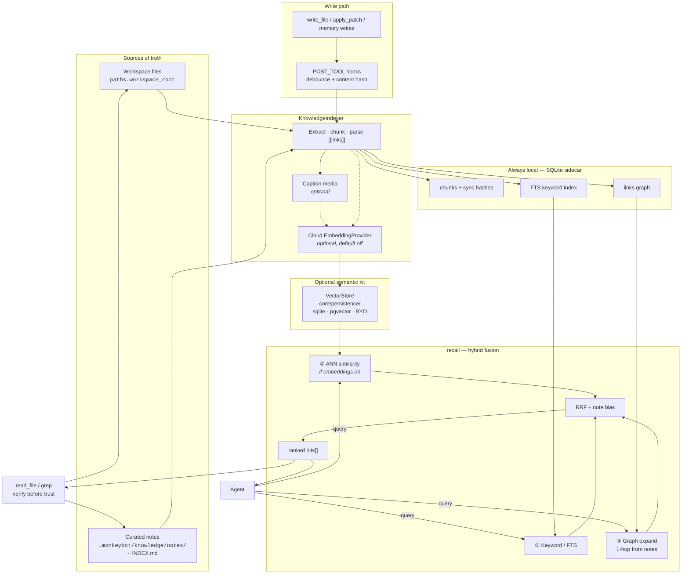
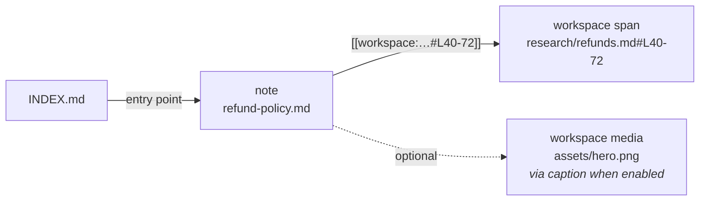
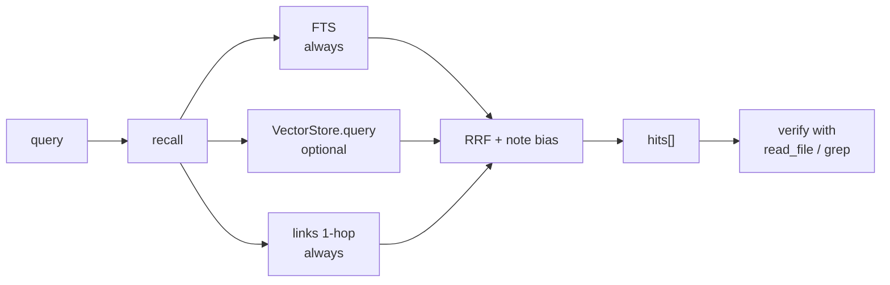
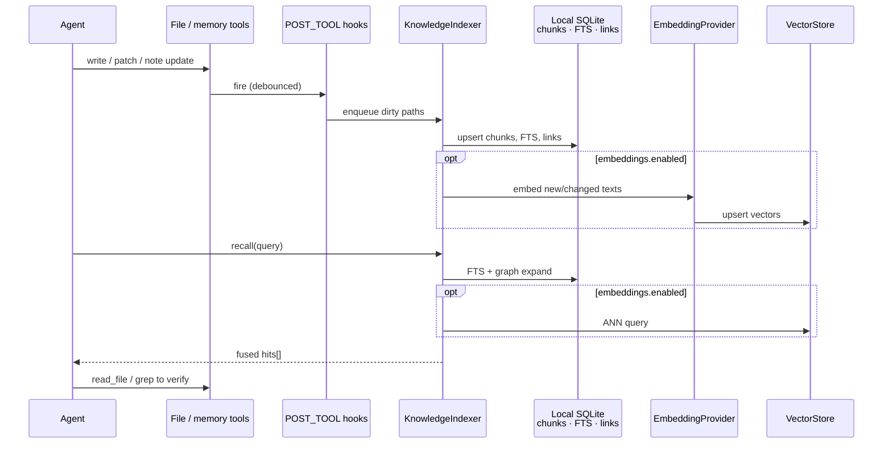
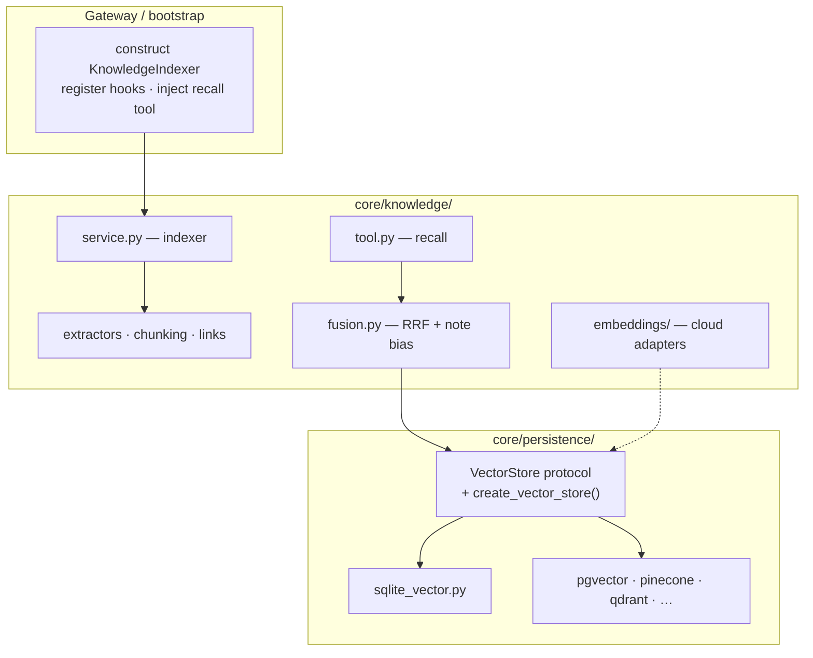

# Unified Knowledge Layer — Design

**Status:** Implemented (shipped in the knowledge-layer PR; see also [knowledge-layer-fixes.md](knowledge-layer-fixes.md))  
**Audience:** MonkeyBot harness + agent authors  
**Related:** [Features & Design Reference](features.md) · memory subsystem · workspace tools (`grep` / `glob` / `read_file`)  
**Supersedes:** earlier framing of a standalone `workspace_search` product disconnected from memory

---

## Summary

Build one **linked knowledge layer** that unifies curated memory notes and workspace files:

- **Provenances:** `note` (agent-authored, trusted) and `workspace_file` (derived from disk).
- **Structure:** Obsidian-style vault with explicit `[[links]]` between notes and workspace spans.
- **Baseline retrieval (always local, ships first):** keyword/FTS + graph expansion through one agent tool (`recall`, extending today’s `search_memory`).
- **Optional semantic layer (default off):** cloud embeddings + pluggable `VectorStore` in `core/persistence/`, captions for media, hook-driven incremental indexing — fused into the same ranked result set, not a second tool or second corpus.

**Ship rule:** Config B (graph + keyword) ships whenever it improves memory recall on its own. Embeddings (Config C) stay opt-in and are justified only where they beat B on cost-adjusted metrics.

---

## System overview

### End-to-end

Two sources of truth feed one indexer. Retrieval always uses local FTS + the link graph; cloud embeddings and a pluggable `VectorStore` are an optional path into the same fusion step. The agent verifies hits with existing file tools.



Dashed edges are the **optional semantic layer** (default off).

### Link graph (notes ↔ workspace)

Notes point at workspace spans; they do not copy file bodies. The indexer materializes the same edges into `links` for join-time expansion.



### Recall pipeline



### Indexing lifecycle



---

## Motivation

| Today | Gap |
|-------|-----|
| `grep` / `glob` / `read_file` | Exact and path-based only; weak for conceptual recall and media |
| `search_memory` / `INDEX.md` | Curated notes only; no link to the workspace files those notes are about |
| Standalone `workspace_search` (prior draft) | Second tool + second corpus → agent picks the wrong surface; re-embeds what curation already captured |

Agents need curated knowledge and raw files to **reinforce each other**: a note about refund policy should surface the workspace span it points at, and a workspace hit should be boostable when a trusted note links to it.

---

## Goals / non-goals

### Goals

- One retrieval tool over notes + workspace-derived chunks (not two competing tools)
- Explicit note ↔ workspace links as a first-class graph
- Always-on local keyword (FTS) + graph expansion; zero embedding cost by default
- Optional cloud semantic layer: default **off**, fail closed, same trust model (“hints → verify with `read_file`”)
- Text-first indexing; caption-then-embed for media when semantic layer is on
- Pluggable vector backends in `core/persistence/` (protocol + lazy factory + optional extras)
- Incremental indexing via hooks + startup/idle scan
- Validate with a structured experiment before committing to BYO vector backends / caption rollout at scale

### Non-goals (near term)

- Local embedding models (deferred)
- Native multimodal embedding spaces (CLIP-style); captions are enough
- Replacing `grep` for identifiers / stack traces
- Cross-workspace or org-wide shared indexes
- Perfect FS watching for external editors (hooks + scan cover agent mutations)
- Shipping six vector backends before the experiment

---

## Product model

### Two provenances, one layer

| `source_type` | Meaning | Source of truth |
|---------------|---------|-----------------|
| `note` | Agent-authored, curated, trusted | Knowledge vault (evolves today’s memory markdown) |
| `workspace_file` | Machine-derived chunk / caption | File under `paths.workspace_root` (referenced, not copied into the vault) |

### Vault layout (Obsidian-like)

```text
.monkeybot/knowledge/          # or evolve paths.memory_storage_uri layout in place
  INDEX.md                     # curated entry points (keep organizer contract)
  notes/
    refund-policy.md           # may [[link]] other notes or workspace spans
                                 # e.g. [[workspace:research/refunds.md#L40-72]]
```

Workspace files stay on disk under the workspace root. Notes hold **pointers** (`[[workspace:path#Lstart-end]]`), not duplicated body text. At index time, `[[links]]` are parsed into a local `links` table (`source_id`, `target_id`, `link_type`) so retrieval can join without re-parsing markdown on every query.

### Agent-facing tool: `recall`

Extends / succeeds `search_memory` as the single knowledge retrieval surface:

```text
recall(
  query: string,
  path_prefix?: string,      # optional filter (workspace-relative or notes/)
  source?: "any"|"note"|"workspace_file",
  modality?: "any"|"text"|"image"|"pdf"|"audio",
  limit?: number             # default ~8–12
) → hits[]
```

Example hits:

```json
{
  "source_type": "note",
  "path": "notes/refund-policy.md",
  "score": 1.0,
  "bm25": -4.12,
  "signals": ["fts", "graph"],
  "snippet": "Annual-plan refunds require …",
  "links": ["workspace:research/refunds.md#L40-72"]
}
```

```json
{
  "source_type": "workspace_file",
  "path": "research/refunds.md",
  "score": 0.72,
  "cosine": 0.81,
  "bm25": -2.05,
  "signals": ["fts", "ann", "graph"],
  "modality": "text",
  "span": { "start_line": 40, "end_line": 72 },
  "snippet": "…refund policy for annual plans…",
  "via": "graph:notes/refund-policy.md"
}
```

```json
{
  "source_type": "workspace_file",
  "path": "assets/hero.png",
  "score": 0.55,
  "signals": ["ann"],
  "cosine": 0.61,
  "modality": "image",
  "caption": "Full-bleed landing hero: product UI on dark navy background",
  "snippet": null
}
```

**Score semantics:** `score` is **normalized per query** (top hit = 1.0, others proportional). Optional `cosine` is ANN similarity (treat < 0.45 as weak). Optional `bm25` is raw FTS5 bm25 (more negative ≈ stronger lexical match). `signals` lists which stages contributed (`fts` / `ann` / `graph`).

**Prompt guidance:**

- Prefer `recall` for conceptual / cross-file / curated knowledge.
- Prefer `grep` for identifiers, stack traces, exact strings.
- For locate-a-file / asset questions, prefer `glob` on the plausible directory.
- `read_file` hits until the normalized score drops sharply (typically top 3–5); reformulate once if off-topic, then fall back to `grep`/`glob`.
- Always verify source lines before treating a fuzzy hit as fact.

**Naming:** implement as `recall` (or keep `search_memory` with expanded behavior during transition). Prefer a clear migration in prompts/evals rather than a silent behavior change under the old name. Final name is an open question; behavior is not.

`recall` is **parallel-safe** (read-only).

### When semantic features activate

| Layer | Default | Registers / spends |
|-------|---------|-------------------|
| Keyword + graph `recall` | On when knowledge layer is enabled (memory path) | Local SQLite only |
| Cloud embeddings + ANN | **Off** (`knowledge.embeddings.enabled: false`) | No embed calls; no remote vector traffic |
| Captions | Off unless embeddings/caption policy enabled | LLM caption calls only when configured |

Misconfigured embedding/store config when embeddings are enabled → log warning, run keyword+graph only (fail soft for semantic; do not take down the harness).

---

## Hybrid retrieval (the core pipeline)

Semantic ANN alone is not hybrid search. Every `recall` fuses up to three signals:

1. **Keyword stage (always)** — FTS5 (or equivalent) over note bodies + workspace chunks/captions.
2. **Semantic stage (optional)** — ANN over chunk vectors via `VectorStore`, only if embeddings enabled and configured.
3. **Graph expansion (always when links exist)** — for each hit that is a curated `note`, pull 1-hop `links` and add referenced workspace spans as candidates with a graph-adjacency boost (not a fresh similarity score).

**Fusion:** reciprocal rank fusion (RRF) across keyword and vector lists; at equal fused score, prefer `source_type == note` over `workspace_file` so curated knowledge wins ties.

**Architectural split:**

- `links` + FTS + file/chunk sync metadata → **always local SQLite** (beside the pluggable vector store).
- `VectorStore` → **similarity only** (sqlite / pgvector / Pinecone / Qdrant / …). Remote stores are not asked to implement graph joins.

### Single-writer invariant

**One gateway process owns writes** to `.monkeybot/knowledge/index.sqlite` (and `vectors.sqlite` when embeddings are on) per workspace.

| Role | Access |
|------|--------|
| Gateway | Writer — indexes on startup / hooks, claims `*.writer-pid` sentinel via an atomic `O_CREAT`/`O_EXCL` create, so two racing gateways cannot both win |
| Subagent workers | **Read-only** — `KnowledgeSubsystem.create(..., read_only=True)` opens SQLite `mode=ro`, runs `search` only (no indexer, no knowledge hooks) |
| Second gateway on the same workspace | **Refused** — `KnowledgeWriterConflictError` if another live PID holds the sentinel |

Indexer dirty queues are process-local; two writers would double-index and race. Multi-replica / shared-storage cloud deploys need a shared store (**pgvector**, Phase 3) — not a second SQLite writer.

See [System overview](#system-overview) for the end-to-end and recall diagrams.
---

## Indexing model

### What gets indexed (workspace side)

| Source | Extraction | Indexed text | Status |
|--------|------------|--------------|--------|
| Text / code / markdown / HTML (stripped) | **Content-aware chunking** (~500–800 tokens, ~10–15% overlap): heading sections for markdown/rst; tree-sitter top-level defs for code when `knowledge-ast` extra is installed (indent/brace heuristic fallback otherwise); top-level key/table groups for JSON/YAML/TOML; line-aligned window for prose. Path + section/symbol prefix on each chunk. `CHUNKER_VERSION` is mixed into the content digest **and stored per file** (`files.chunker_version`) so a version bump re-chunks existing workspaces even when mtimes never change. | Chunk text → FTS; embed when semantic on | **Shipped** |
| PDF | Per-page text via `pypdf` (`knowledge-media` extra); empty pages skipped (no OCR) | One FTS chunk per page (`start_line`/`end_line` = page number); soft-fail if extra missing | **Shipped** |
| DOCX | Paragraphs **and tables** via `python-docx` (`knowledge-media` extra), walked in document order; table rows render as pipe-separated cells | Body text → same chunker as prose; soft-fail if extra missing | **Shipped** |
| Images (png/jpeg/gif/webp) | Caption per `knowledge.captions` policy | Caption string → FTS; embed when semantic on | **Shipped** |
| Notes | Full note + parsed `[[links]]` | Note text → FTS; edges → `links` table | **Shipped** |

Ignore the same noise dirs as workspace `grep` (`.git`, `node_modules`, `.venv`, `__pycache__`, …). Skip binaries over `max_file_bytes`. Install media extractors with `uv sync --extra knowledge-media`.

**Config B still needs an indexer** — FTS over workspace chunks is not “free memory tweaks.” The same extract/chunk/hash pipeline runs; only cloud embed + remote vector upsert are skipped when embeddings are off.

### Captions (media) — semantic kit

- `captions: off` — skip image files (PDF/DOCX still index when the media extra is installed).
- `captions: path` — **default**; deterministic caption from relative path + stem (e.g. `Image: public/images/auth-hero.png (auth-hero)`). Enables FTS/basename recall without an LLM.
- `captions: llm` — one-shot via OpenAI-compatible vision (`caption_model`, default `gpt-4o-mini` when unset); cache by **content hash** under `.monkeybot/knowledge/captions/`. On failure or missing `OPENAI_API_KEY`, falls back to path caption. Path tokens are retained so basename search still works.
- Prefer validating **caption-on-first-miss** vs background sweep in the mixed-media experiment (see below).
- Caption cache under `.monkeybot/knowledge/captions/` even when vectors are remote.
- Legacy YAML key `caption` (singular) is accepted as an alias for `captions`.

### Incremental updates (hooks)

```text
startup / idle sweep
  └─ KnowledgeIndexer.ensure_ready()
       walk workspace + notes → (path, mtime, content_hash)
       upsert dirty chunks · refresh links · delete missing

POST_TOOL (write_file, replace_in_file, apply_patch, delete, memory writes, …)
  └─ enqueue path(s) (debounce 200–500ms)

optional idle timer
  └─ flush queue / light rescan
```

Background only — tools are not blocked on embedding latency. `recall` may briefly wait for a dirty flush under `path_prefix` (short timeout; then best-effort with optional `stale: true`).

---

## Optional semantic layer (implementation kit)

This section is the portable kit from the earlier workspace-index proposal — **plugged into** the unified layer, not a parallel product.

### Cloud embeddings

Local embedders are out of scope for v1 (weights may exist on Hugging Face; Phase 2 uses the **hosted** OpenAI-compatible API only).

```text
EmbeddingProvider
  model_id: str
  dim: int
  embed_documents(texts: list[str]) -> list[vector]   # passage / document side
  embed_query(text: str) -> vector                    # query side
```

| `embeddings.provider` | Notes |
|-----------------------|--------|
| `nvidia` | **Default** — Nemotron-3-Embed-1B; `query:` / `passage:` prefixes; client-side Matryoshka (`NVIDIA_API_KEY`) |
| `openai` | `text-embedding-3-small` @ 1536; API `dimensions` (`OPENAI_API_KEY`) |
| `voyage` | `voyage-3-lite` @ 512; OpenAI-compat + `input_type` query/document (`VOYAGE_API_KEY`) |
| `gemini` / `google` | `text-embedding-004` @ 768 via `google-genai` (`GEMINI_API_KEY`) |
| `openai_compatible` | Custom `base_url` + `model` required; same OpenAI SDK path (`OPENAI_API_KEY`) |

All providers implement `EmbeddingProvider` (`model_id`, `dim`, `embed_documents`, `embed_query`). Factory: `core/knowledge/embeddings/factory.py`. Unknown / misconfigured providers soft-degrade to keyword+graph.

#### Pinned model: Nemotron-3-Embed-1B

| Field | Value |
|-------|--------|
| **Family** | NVIDIA Nemotron-3 Embed 1B |
| **Config `model`** | `nvidia/nemotron-3-embed-1b` |
| **HF reference** | `nvidia/Nemotron-3-Embed-1B-BF16` (weights / card; local inference deferred) |
| **Endpoint** | `POST {base_url}/embeddings` — default `https://integrate.api.nvidia.com/v1` |
| **Auth** | `NVIDIA_API_KEY` (same build.nvidia.com key as chat) |
| **Output dim** | **2048** full; Matryoshka OK — slice prefix then **L2-renormalize** (config `dimensions`, default 2048) |
| **Max input** | Model card allows up to 32k tokens; indexer still chunks ~700 tokens (unchanged) |
| **Asymmetry** | Required: prefix **`query: `** for `embed_query`, **`passage: `** for `embed_documents` (or pass NIM `input_type` if the hosted route prefers that — adapter implements one path consistently) |
| **Similarity** | Vectors L2-normalized → cosine ≡ dot product; store floats; query with cosine / inner product |

**Adapter notes (`core/knowledge/embeddings/nvidia.py`):**

- Reuse `openai` SDK against NVIDIA base URL (same pattern as `providers/nvidia.py`).
- Batch with `embeddings.batch_size` (default 32–64); backoff on 429 / throughput errors (NVIDIA free tier is low-throughput — share the concurrency discipline from `_openai_compat`).
- On model or `dimensions` change: **automatic** — rows are namespaced by `model_id`+`dim`. Queries only score rows written by the active model, and startup (`KnowledgeIndexer.ensure_ready`) calls `delete_stale_models` to drop the rest; the following scan re-embeds those paths. FTS/links sidecar stays. With `startup_scan: false` the purge still runs, but re-embedding waits for the next scan or file change.
- Fail soft: embed errors log + skip ANN for that turn / dirty path; keyword+graph still run.

### Pluggable `VectorStore` in `core/persistence/`

Same pattern as `HistoryStore` / `create_storage_backend`: protocol + lazy imports + optional extras.

| Piece | Placement |
|-------|-----------|
| `VectorStore` protocol (+ chunk/hit types) | `core/persistence/backends.py` or sibling `vector_backends.py` |
| `create_vector_store(config)` | Lazy factory next to `create_storage_backend` |
| SQLite vectors + sync helpers | `core/persistence/sqlite_vector.py` |
| pgvector | `core/persistence/pgvector.py` |
| Pinecone / Qdrant / Chroma / HTTP | `*_vector.py` under persistence; optional extras |
| Knowledge indexer / FTS / links / `recall` | `core/knowledge/` (or evolved `core/memory/` + thin workspace indexer) — **consumes** `VectorStore` |

**Local sync sidecar:** file-hash / mtime / chunk metadata / FTS / `links` always local SQLite under `.monkeybot/knowledge/` (or `.monkeybot/index/`). Remote DBs hold vectors only.

```text
VectorStore
  upsert(chunks: list[ChunkRecord]) -> None
  delete_by_path(path: str) -> None
  delete_missing(alive_paths: set[str]) -> None
  query(vector, *, limit, path_prefix?, modality?) -> list[Hit]
```

| `store.type` | Module (proposed) | Role |
|--------------|-------------------|------|
| `sqlite` | `sqlite_vector.py` | Default when embeddings on; fine for experiment + small agents |
| `pgvector` | `pgvector.py` | BYO Postgres |
| `pinecone` / `qdrant` / `chroma` / `http` | dedicated modules | BYO; extras; after experiment |

Namespace/collection scoped by agent + workspace identity. Missing optional extra → clear install hint at factory time.

---

## Configuration (`monkeybot.yaml`)

```yaml
# Unified knowledge layer. Keyword + graph recall improves memory even with embeddings off.
knowledge:
  enabled: true                 # master switch for unified recall (evolve from memory hook)

  # Vault / notes root — may alias or replace paths.memory_storage_uri over time
  # root: .monkeybot/knowledge

  recall:
    default_limit: 10
    # tool_name: recall         # or keep search_memory during migration

  # Always-local graph + FTS store (sync sidecar)
  local_index:
    path: .monkeybot/knowledge/index.sqlite

  indexer:
    debounce_ms: 300
    startup_scan: true
    max_file_bytes: 5000000
    chunk_tokens: 700
    chunk_overlap_ratio: 0.12

  # --- Optional semantic layer (default OFF) ---
  embeddings:
    enabled: false              # no cloud embed calls until explicitly on
    provider: nvidia            # nvidia | openai | voyage | gemini | openai_compatible
    # model / dimensions / base_url optional — per-provider defaults apply when omitted:
    #   nvidia  → nvidia/nemotron-3-embed-1b @ 1024  (NVIDIA_API_KEY; client Matryoshka)
    #   openai  → text-embedding-3-small @ 1536       (OPENAI_API_KEY)
    #   voyage  → voyage-3-lite @ 512                 (VOYAGE_API_KEY)
    #   gemini  → text-embedding-004 @ 768            (GEMINI_API_KEY)
    #   openai_compatible → model + base_url required (OPENAI_API_KEY)
    # model: nvidia/nemotron-3-embed-1b
    # dimensions: 1024
    # base_url: https://integrate.api.nvidia.com/v1
    batch_size: 32

  store:
    type: sqlite                # experiment default; Phase 3 first BYO: pgvector
    path: .monkeybot/knowledge/vectors.sqlite
    # --- Phase 3: pgvector ---
    # type: pgvector
    # url: postgresql://…
    # table: knowledge_chunks
    # pinecone / qdrant / chroma / http fields as needed…

  captions: path                # off | path | llm  (path = FTS by filename; llm = vision + cache)
  # caption_model: gpt-4o-mini  # used when captions: llm
```

**Accepted risk:** FTS (`index.sqlite`) and ANN (`vectors.sqlite`) are separate SQLite files committed independently — a crash between the two can leave vectors pointing at stale FTS chunk IDs. There is no cross-DB transaction. Self-heal layers:

1. **Startup / rescan** — `startup_scan: true` (default) runs a full content-hash walk: re-embed on hash mismatch and `delete_missing` for both FTS and vectors. When `startup_scan: false`, the disk walk is skipped, but if embeddings are on the indexer still prunes vector rows whose paths are absent from FTS (`delete_missing` against the current index). Re-embed on hash mismatch stays gated on a full scan (startup or workspace rescan).
2. **Query soft-drop** — `_ingest_ann` skips ANN hits whose chunk snippet cannot be resolved in FTS (stale orphan between crash and heal), so recall never surfaces dangling vector IDs.
3. **Model scoping** — every vector row records `model_id`+`dim`; queries filter on the active model and startup purges the rest, so a provider or `dimensions` switch cannot mix incomparable vectors into one cosine ranking.

Env overrides (suggested): `KNOWLEDGE_ENABLED`, `KNOWLEDGE_EMBEDDINGS_ENABLED`, plus existing provider key envs. Env wins over YAML per harness norms.

Legacy: while migrating, `paths.memory_storage_uri` and the memory organizer continue to work; the knowledge root may start as a thin layout over the existing memory URI.

---

## Architecture (harness placement)

Harness modules and persistence boundaries. Runtime data flow is in [System overview](#system-overview).



### Suggested module layout

```text
src/monkeybot/core/persistence/
  backends.py / vector_backends.py   # VectorStore protocol
  sqlite_vector.py
  pgvector.py
  pinecone_vector.py / qdrant_vector.py / chroma_vector.py / http_vector.py
  # create_vector_store(...)

src/monkeybot/core/knowledge/        # or evolve core/memory/ in place
  __init__.py
  service.py           # KnowledgeIndexer: scan, queue, debounce, link parse
  extractors.py
  chunking.py
  fts.py               # local FTS helpers (may sit on sqlite sidecar)
  links.py             # [[wiki]] parse + links table
  fusion.py            # RRF + note bias + graph expand
  embeddings/          # cloud EmbeddingProvider adapters
  tool.py              # recall
```

Wire-up: bootstrap/gateway constructs indexer when knowledge enabled; registers `POST_TOOL` / memory write hooks; injects `recall` into tool defs; builds `VectorStore` only when `embeddings.enabled`.

**Invariant:** `core/` stays gateway-agnostic. BYO `store.type: http` is a persistence adapter, not a gateway route.

### Relationship to today’s memory

| Concern | v1 approach |
|---------|-------------|
| Organizer / `INDEX.md` | Keep; notes remain curated entry points |
| Prompt `memory_index` injection / curator | Keep for now; optionally later pull from same vault |
| `search_memory` | Migrate to `recall` (name TBD) |
| Workspace files | Indexed into same local chunk/FTS tables; linked from notes |

Do **not** ship a parallel `workspace_search` tool.

---

## Experiment before semantic scale-out

Claims about graph value, hybrid vs keyword-only, and embedding ROI are hypotheses. Validate before building the full BYO vector matrix and aggressive captioning.

### Dataset

Seed from **[auriga-web](https://github.com/human-plus-machine/auriga-web)**. Labeled ground truth (48 Q&A pairs + agent prompt pack) lives in:

[`evals/knowledge_layer/auriga_web_qa.md`](../evals/knowledge_layer/auriga_web_qa.md)

**Run protocol:** clone auriga-web into the agent workspace → paste the questions-only prompt pack → require `Qxx:` / `Evidence:` answers → score the transcript against Answer/Accept fields (do not give the answer file to the agent under test).

Derive experiment slices from the same clone:

| Workspace type | How to derive |
|----------------|---------------|
| **Code repository** | Repo as-is (source + docs) — primary slice for the Q&A file |
| **Notes-heavy** | Seed `.monkeybot/knowledge/notes/` with curated notes + `[[workspace:…]]` links into auriga-web paths from the Q&A evidence |
| **Mixed-media** | Same tree (auriga-web already has `public/images/`, DPA PDF) — use media questions Q36–Q39, Q46 |
| **Large unstructured** | Optional noisy subset or stripped headings to stress keyword search |

### Configurations

| Config | Active |
|--------|--------|
| **A — Baseline** | `grep` / `glob` / `read_file` only (no knowledge graph / FTS layer) |
| **B — Linked graph, no embeddings** | Unified notes + links + FTS + graph expansion |
| **C — Full hybrid** | B + cloud embeddings + ANN fused in |

### Metrics

- **Recall@k / MRR / verification rate** — computed from any session transcript via:

```bash
uv run python evals/knowledge_layer/recall_rank_report.py \
  --transcript /path/to/session/transcript.ndjson \
  [--qa-file evals/knowledge_layer/auriga_web_qa.md]
```

  For each question’s **Evidence** path, the report takes the best (lowest) rank across all `recall` hit lists in the transcript. Verification = `read_file` of a recall hit within the next N events (default 8). Endurance block reports recall first-half vs second-half, `ContextSummarized` count, and `read_file` thrash (≥3 reads of the same path).
- Tool calls / turns to correct cite  
- Cost per query (embed + caption for C)  
- Latency (including index lag)  
- **Link density** on notes-heavy slice (empty graphs understate B)

### Eval slices (standard)

| Slice | Questions | Purpose | Gate |
|-------|-----------|---------|------|
| **Hard subset** | Q06, Q07, Q13, Q14, Q19, Q29, Q30, Q40, Q42, Q48 | Lexical / multi-file correctness | Score ≥ Config A (9/10); B1 baseline **10/10** |
| **Semantic S01–S10** | Paraphrases (see below) | Embedding / first-hit quality | Config C must beat B semantic **9/10** |
| **Full-48 endurance** | Q01–Q48 in one session | Tool-selection decay under context pressure / summarization | Score + back-half recall usage; see [full-48 baseline](#full-48-endurance-baseline-config-c) |

Score answers with:

```bash
# Hard subset (default)
uv run python evals/knowledge_layer/score_auriga_answers.py --answers /path/to/answers.md

# All 48
uv run python evals/knowledge_layer/score_auriga_answers.py --answers /path/to/answers.md --all
```

Accepts both `Qxx:` lines and `## Qxx:` / `### Qxx:` markdown headings; strips emphasis before Accept matching.

### Decision rule

- **Ship B** if it improves memory/recall vs A (and vs today’s `search_memory`) on notes-heavy and overall — **even if C later only helps some workspace types.** B is a memory upgrade, not a semantic MVP.
- **Enable C (embeddings kit)** only where it beats B by a margin that justifies API cost and privacy tax (likely mixed-media + large-unstructured).
- Expand BYO vector backends **after** the experiment, not before. Experiment infra: local SQLite FTS/links + one embedding provider + sqlite `VectorStore` is enough.

### Baseline run log (Config A — grep/glob/read only)

First scored run against the **10 hardest** auriga-web questions (conceptual / multi-file subset). No knowledge graph / FTS / embeddings — today’s tools only. Record kept here so later Config B/C runs have a fixed comparison point.

| Field | Value |
|-------|--------|
| **Date** | 2026-07-16 (session started 2026-07-17T02:12:23Z UTC) |
| **Config** | **A** — `grep` / `glob` / `read_file` / `run_command` (no unified knowledge layer) |
| **Corpus** | auriga-web clone in agent workspace |
| **Model** | `nvidia/nemotron-3-ultra-550b-a55b` (provider: `nvidia`) |
| **Questions asked** | Hard subset: **Q06, Q07, Q13, Q14, Q19, Q29, Q30, Q40, Q42, Q48** (see below) |
| **Ground truth** | [`evals/knowledge_layer/auriga_web_qa.md`](../evals/knowledge_layer/auriga_web_qa.md) |
| **Agent answers** | `test_bot/workspace/auriga-web-answers.md` (local run artifact) |
| **Transcript** | `.monkeybot/transcripts/20260717T021223Z_02b0c2a9-6cc4-4cc5-964f-20278898fdb3/` |
| **User turns** | **3** (`UserMessage` / `TurnComplete`) |
| **Inner turns** | **50** (provider request/response loops) |
| **Score** | **9 / 10** |

**Questions (hard subset):**

1. **Q06** — How does `getIdToken()` avoid races when multiple callers need a token while Firebase auth is still initializing?
2. **Q07** — Does SAT prep chat/session traffic go through LangGraph streaming? If not, what does it use instead?
3. **Q13** — What component library style does shadcn use here, and what underlying library powers the Button?
4. **Q14** — Why does `tailwind.config.cjs` include paths under `../auriga-agents/agents/*/ui/**`?
5. **Q19** — Which assistants does `assistantSkipsLangGraphStream` always treat as skipping LangGraph stream (by id equality), before the Agent Engine check?
6. **Q29** — Which doc is the better source of Auriga-specific architecture than the top-level README, and why?
7. **Q30** — Name the main external backends the front end talks to for auth, CRUD/dashboard data, LangGraph agents, and MonkeyBot/Agent Engine.
8. **Q40** — Why might `essay_coach` also skip LangGraph streaming in tests/flags even though SAT/ACT are the explicit id checks?
9. **Q42** — What package or helper initializes the LangGraph production API passthrough on `/api/[..._path]`?
10. **Q48** — What is the dual-runtime idea for agents in this frontend?

**Per-question results:**

| ID | Result | Note |
|----|--------|------|
| Q06 | Pass | `authReadyPromise` / shared `onAuthStateChanged` |
| Q07 | Pass | REST `/v1/sat/sessions`; not LangGraph stream |
| Q13 | **Fail** | Got `new-york`; said Radix for Button — actual is `react-aria-components` (`src/components/ui/button.tsx`) |
| Q14 | Pass | `LoadExternalComponent` / auriga-agents UI scan |
| Q19 | Pass | `sat_prep`, `act_prep` |
| Q29 | Pass | `REPO_SUMMARY.md` |
| Q30 | Pass | Firebase, Connect/CE, LangGraph, Agent Engine |
| Q40 | Pass | Agent Engine runtime flag path |
| Q42 | Pass | `initApiPassthrough` / `langgraph-nextjs-api-passthrough` |
| Q48 | Pass | LangGraph vs Agent Engine dual runtime |

**Notes:** Session also hit a chat TUI crash (`MarkupError` on tool titles containing argv JSON `[` / `*.ts` globs); fixed by plain-text Collapsible titles in the CLI. Eval completed across 3 user turns after recovery.

### Config B run log (linked graph + FTS — no embeddings)

Same hard subset and model as Config A. Knowledge layer enabled (`recall` + local SQLite FTS); workspace indexed after clone; notes not seeded (FTS-only, empty link graph). Prompt required `recall` first, then `read_file` to verify.

#### B0 — first Config B attempt (strict AND FTS) — do not ship on this alone

| Field | Value |
|-------|--------|
| **Date** | 2026-07-16 (session started 2026-07-17T02:54:40Z UTC) |
| **Config** | **B** — `recall` + FTS + links (embeddings off); FTS MATCH used **AND** of NL tokens |
| **Transcript** | `test_bot/workspace/.monkeybot/transcripts/20260717T025440Z_f372c990-eb40-4ab9-899d-4899b5db9c56/` |
| **User turns** | **1** |
| **Inner turns** | **39** |
| **Tool mix** | `recall`×5, `grep`×10, `read_file`×20, `glob`×3 |
| **Score** | **9 / 10** (miss **Q29** — cited blog post instead of `REPO_SUMMARY.md`) |

**Recall quality:** most queries returned **0 hits** or only `memory/chat_log.md` (AND’d NL tokens too strict). Agent fell back to `grep`/`read_file`. Same score as A with a different miss (Q13 fixed, Q29 regressed).

**Follow-up fix:** loosen FTS to **OR** + stopwords; skip/down-rank `memory/chat_log.md` and `memory/raw/` in fusion.

#### B1 — Config B after loose FTS — beats Config A

| Field | Value |
|-------|--------|
| **Date** | 2026-07-16 (session started 2026-07-17T03:13:13Z UTC) |
| **Config** | **B** — `recall` + FTS + links (embeddings off); FTS MATCH uses **OR** of content tokens + chat_log noise filter |
| **Corpus** | auriga-web clone in agent workspace (~1400 files / ~4000 chunks indexed) |
| **Model** | `nvidia/nemotron-3-ultra-550b-a55b` (provider: `nvidia`) |
| **Questions asked** | Same hard subset as Config A |
| **Ground truth** | [`evals/knowledge_layer/auriga_web_qa.md`](../evals/knowledge_layer/auriga_web_qa.md) |
| **Transcript** | `test_bot/workspace/.monkeybot/transcripts/20260717T031313Z_6fdf0e42-5a41-4d39-b7c9-b3c287ab9094/` |
| **User turns** | **1** |
| **Inner turns** | **24** |
| **Tool mix** | `recall`×6, `read_file`×14, `glob`×3, **`grep`×0** |
| **Tool time** | ~197ms |
| **Score** | **10 / 10** |

**Per-question results:**

| ID | Result | Note |
|----|--------|------|
| Q06 | Pass | `authReadyPromise` / `onAuthStateChanged`; recall top hit `contextengine.ts` |
| Q07 | Pass | not LangGraph stream; `sat_prep` / REST path |
| Q13 | Pass | `new-york` + `react-aria-components` (fixes Config A miss) |
| Q14 | Pass | `LoadExternalComponent`; recall top hit `tailwind.config.cjs` |
| Q19 | Pass | `sat_prep`, `act_prep` |
| Q29 | Pass | `REPO_SUMMARY.md` (fixes B0 miss) |
| Q30 | Pass | Firebase, Connect/CE, LangGraph, Agent Engine |
| Q40 | Pass | Agent Engine runtime flag path |
| Q42 | Pass | `initApiPassthrough` / `langgraph-nextjs-api-passthrough` |
| Q48 | Pass | LangGraph vs Agent Engine dual runtime |

**Comparison (hard subset):**

| Run | Score | Inner turns | Notable |
|-----|-------|-------------|---------|
| **A** | 9/10 | 50 | Miss Q13 (Radix); grep-heavy |
| **B0** (AND FTS) | 9/10 | 39 | Recall useless; miss Q29 |
| **B1** (OR FTS) | **10/10** | **24** | Recall steered; **no grep** |

**Decision:** Config B (keyword + graph layer, with loose FTS) **improves** vs A on this hard subset (accuracy + fewer inner turns). Supports shipping B independent of embeddings. Notes-heavy / graph density and Config C still open.

### Semantic-slice baseline (pre-embeddings) — Config B FTS on paraphrased questions

Paraphrase pack **S01–S10** (same Accept targets as related Qxx, but questions avoid answer identifiers). Purpose: fixed baseline **before** Phase 2 embeddings so Config C can be compared on questions where keyword overlap is weak.

| Field | Value |
|-------|--------|
| **Date** | 2026-07-16 (session started 2026-07-17T03:27:03Z UTC) |
| **Config** | **B** — `recall` + loose OR FTS (embeddings **off**); no notes seed |
| **Slice** | Semantic S01–S10 (paraphrases of Q06, Q07, Q13, Q14, Q24, Q28, Q29, Q40, Q48, Q37) |
| **Model** | `nvidia/nemotron-3-ultra-550b-a55b` (provider: `nvidia`) |
| **Transcript** | `test_bot/workspace/.monkeybot/transcripts/20260717T032703Z_ac0c67a5-9822-4ea7-af36-b478ada6d6fc/` |
| **User turns** | **1** |
| **Inner turns** | **9** |
| **Tool mix** | `recall`×15, `read_file`×14, `grep`×2 |
| **Score** | **9 / 10** |

**Per-question results:**

| ID | Maps to | Result | Note |
|----|---------|--------|------|
| S01 | Q06 | Pass | `authReadyPromise` / `onAuthStateChanged` |
| S02 | Q07 | Pass | REST / `sat_prep` (not LangGraph stream) |
| S03 | Q13 | **Fail** | Got `new-york`; said Radix Slot — actual Button is `react-aria-components` |
| S04 | Q14 | Pass | `LoadExternalComponent` / auriga-agents scan |
| S05 | Q24 | Pass | `nuqs` / `useQueryState` |
| S06 | Q28 | Pass | `proxy.ts` |
| S07 | Q29 | Pass | `REPO_SUMMARY` |
| S08 | Q40 | Pass | Agent Engine runtime for essay coach |
| S09 | Q48 | Pass | LangGraph + Agent Engine dual runtime |
| S10 | Q37 | Pass | auth-hero student/parent/counselor images |

**Recall quality (why this slice matters for Config C):** first-hit FTS often missed the true evidence file on paraphrases (e.g. design-system → unrelated counselor UI; “competing waits” → `privacy.ts` before `contextengine.ts`; hero images → `routing.ts`). Agent recovered via more `recall`/`read_file` (and light `grep`). Same S03/Q13 miss pattern as Config A hard subset.

**Use:** Re-run **identical S01–S10** after embeddings (Config C). Ship/enable C only if it improves vs this **9/10** baseline (especially S03 and first-hit precision), not vs the lexical hard subset where B1 already scores 10/10.

### Config C run log (FTS + ANN — Nemotron-3-Embed-1B)

| Field | Value |
|-------|--------|
| **Date** | 2026-07-16 (session started 2026-07-17T03:59:17Z UTC) |
| **Config** | **C** — `recall` + loose OR FTS + **ANN** (`nvidia/nemotron-3-embed-1b`, dim 2048); vectors ~3993 chunks |
| **Slice** | Semantic S01–S10 (same paraphrase pack as Config B baseline) |
| **Model** | `nvidia/nemotron-3-ultra-550b-a55b` (provider: `nvidia`) |
| **Transcript** | `test_bot/workspace/.monkeybot/transcripts/20260717T035917Z_38741f39-6c0c-43f6-ad0a-e69512aa8c81/` |
| **User turns** | **1** |
| **Inner turns** | **5** |
| **Tool mix** | `recall`×10, `read_file`×10, `load_file`×10 (all failed — text files; recovered via `read_file`); **`grep`×0** |
| **Score** | **10 / 10** |

**Per-question results:**

| ID | Maps to | Result | Note |
|----|---------|--------|------|
| S01 | Q06 | Pass | `authReadyPromise` / `onAuthStateChanged` |
| S02 | Q07 | Pass | REST / `sat_prep` |
| S03 | Q13 | **Pass** | `new-york` + **`react-aria-components`** (fixed vs Config B Radix miss) |
| S04 | Q14 | Pass | `LoadExternalComponent` / auriga-agents |
| S05 | Q24 | Pass | `nuqs` |
| S06 | Q28 | Pass | `proxy.ts` |
| S07 | Q29 | Pass | `REPO_SUMMARY` |
| S08 | Q40 | Pass | Agent Engine for essay coach |
| S09 | Q48 | Pass | LangGraph + Agent Engine |
| S10 | Q37 | Pass | auth-hero student/parent/counselor |

**Decision:** Config C **beats** semantic baseline (**10/10** vs **9/10**), fixing the S03/react-aria miss. Fewer inner turns than B semantic (5 vs 9). Supports enabling embeddings opt-in for paraphrase-heavy retrieval; keep default off for cost/privacy until product wants it.

### Full-48 endurance baseline (Config C)

Hard subset and S01–S10 never cross a summarization boundary. The **full-48** slice asks Q01–Q48 in one session and is the gate for context-pressure / tool-selection decay.

| Field | Value |
|-------|--------|
| **Date** | 2026-07-17 (session `20260717T043739Z`) |
| **Config** | **C** — FTS + graph + Nemotron-3-Embed-1B ANN (pre F1–F9 ranking/context fixes) |
| **Corpus** | auriga-web clone in agent workspace |
| **Model** | `nvidia/nemotron-3-ultra-550b-a55b` |
| **Questions** | **Q01–Q48** (all) |
| **Ground truth** | [`evals/knowledge_layer/auriga_web_qa.md`](../evals/knowledge_layer/auriga_web_qa.md) |
| **Transcript** | `20260717T043739Z_ea295c94-f29d-4218-b6f7-11d9f2ac0ad9` |
| **Score** | **39 / 48** (manual; scorer now supports `--all` + `## Qxx:` headings) |
| **Recall usage** | Last `recall` ≈ Q22; **back-half recall ≈ 0** after context summarization |
| **ContextSummarized** | **2** (seq ~158, ~278) |
| **Failure modes** | Graph-noise top-10 (seq 173) → recall abandonment; 5 hallucinated Evidence paths (Q36–Q46 class); rank-4 misses earlier |
| **Recall@k / MRR** | Recompute with `recall_rank_report.py` when transcript is available; treat as **pre-fix baseline** |
| **Re-baseline** | After F1–F9 (ranking + context resilience). Gate: score ≥ 39/48, **second-half recall calls > 0**, thrash warnings ≈ 0 |

**Endurance gate (fail if):**

1. Answer score regresses below this baseline without an explained tradeoff.  
2. Second-half recall call count is **0** while first-half had recalls (tool-selection decay).  
3. `ContextSummarized` count rises and coincides with recall abandonment (track via rank report endurance block).

### Config B run protocol

```bash
# Optional: seed notes-heavy links from Evidence fields
uv run python evals/knowledge_layer/seed_auriga_notes.py \
  --agent-root /path/to/test_bot \
  --repo-prefix auriga-web

# Ensure knowledge.enabled: true; prefer prompting recall-first for measurement.
# Score answers (hard subset or --all):
uv run python evals/knowledge_layer/score_auriga_answers.py \
  --answers /path/to/answers.md
  # --all

# Retrieval rank + endurance from transcript:
uv run python evals/knowledge_layer/recall_rank_report.py \
  --transcript /path/to/session/transcript.ndjson
```

---

## Freshness, cost, and safety

- **Cost:** embeddings/captions only when `embeddings.enabled` (and caption policy on) and content changes; debounce + content-hash mandatory.
- **Privacy:** with embeddings on, chunk/caption text leaves to the cloud provider — document clearly for opt-in.
- **Staleness:** external edits lag until scan; agent writes near-real-time via hooks.
- **Trust:** hits are hints; verify with `read_file` / `grep`.
- **Quotas:** batch + backoff; soft-fail semantic stage rather than crash the turn.

---

## Phased delivery

### Phase 1 — Config B (ship if memory improves)

1. Local knowledge SQLite: chunks, FTS, links, sync hashes  
2. Note layout + `[[workspace:…]]` parse; indexer for notes + workspace text  
3. `recall` tool with keyword + graph fusion; migrate from `search_memory`  
4. Hooks + debounce + startup scan  
5. Repo-seeded eval dataset + A vs B measurement  
6. **Ship B** when metrics support it  

### Phase 2 — Semantic kit (opt-in, default off)

**Goal:** Config C = Config B + ANN from **Nemotron-3-Embed-1B**, fused via RRF. Default remains `embeddings.enabled: false`. Ship C only if it beats the [semantic-slice baseline](#semantic-slice-baseline-pre-embeddings--config-b-fts-on-paraphrased-questions) (S01–S10, **9/10**).

#### 2a — Protocols & NVIDIA adapter

1. `EmbeddingProvider` protocol under `core/knowledge/embeddings/`  
2. `NvidiaEmbeddingProvider`: OpenAI-compatible client → `integrate.api.nvidia.com/v1/embeddings`  
   - `model=nvidia/nemotron-3-embed-1b`, `dimensions=2048` (configurable)  
   - `query: ` / `passage: ` prefixes (or equivalent `input_type`)  
   - Auth: `NVIDIA_API_KEY`  
3. `VectorStore` protocol + `create_vector_store()` in `core/persistence/vector_backends.py`  
4. `sqlite_vector.py`: store `(chunk_id, path, model_id, dim, vector BLOB)`; brute-force cosine is fine for experiment scale (~4k chunks)

#### 2b — Indexer + fusion wire-up

5. On chunk upsert (content-hash miss): embed passage text → `VectorStore.upsert` (background; never block write tools)  
6. On delete / path drop: `delete_by_path`  
7. `fusion.py`: third list = ANN hits; RRF with FTS + graph; same note bias on ties  
8. Soft-fail: missing key / API error → log warning, recall = B-only for that call  
9. Config: `embeddings.enabled: false` by default; example yaml pins Nemotron-3-Embed-1B

#### 2c — Captions (still behind policy)

10. Caption path (`off` / `llm`) unchanged; caption uses **`model.name`** when vision-capable; prefer first-miss until measured. Captions become embeddable text when semantic on.

#### 2d — Eval gate (Config C)

11. Re-index test_bot workspace with embeddings on (expect one-time embed cost over ~4k chunks; batch + hash skip)  
12. Re-run **identical S01–S10** paraphrase pack; compare to Config B semantic baseline (**9/10**, miss S03)  
13. Optional: re-check hard lexical subset still ≥ B1 (**10/10**) — embeddings must not regress keyword path  
14. **Enable / recommend C** only if S01–S10 improves (target: fix S03 and/or first-hit precision) at acceptable latency/cost  

### Phase 3 — Scale-out

- First BYO store: **pgvector**; then other backends, more embed providers, `sqlite-vec`, audio transcripts, richer PDF, cost/metrics events, link-writing affordances so agents actually create edges  
- Optional later: local Nemotron-3-Embed weights (`nvidia/Nemotron-3-Embed-1B-BF16`) for air-gapped agents — same `EmbeddingProvider` interface  

---

## Open questions

Resolved:

| # | Topic | Decision |
|---|--------|----------|
| 1 | Tool name | ~~`recall`~~ → **`search`** as of 2026-07-17 (F21; `recall` kept as alias, migrate off `search_memory`) |
| 2 | Knowledge root | **`.monkeybot/knowledge/`** |
| 3 | First embedding provider (Phase 2) | **NVIDIA** |
| 4 | First BYO store after sqlite (Phase 3) | **pgvector** |
| 5 | Caption model | **`captions: path` default**; `llm` uses `caption_model` or `gpt-4o-mini` via OpenAI-compat vision |
| 6 | Protocol placement | **`vector_backends.py`** (keep session-store protocols separate) |
| 7 | Subagents | **Read-only `search` against parent index** (`read_only=True`; no indexer/hooks) |
| 8 | Eval dataset | Seed from **auriga-web**; labeled Q&A in a markdown file; agent clones repo, answers all questions; score by parsing the transcript |
| 9 | Phase 2 embed model | **`nvidia/nemotron-3-embed-1b`** (Nemotron-3-Embed-1B, dim **2048**, query/passage prefixes) |

Still open / follow-ups: confirm hosted NIM short-name if build.nvidia.com differs slightly from `nvidia/nemotron-3-embed-1b` (adapter should accept override via yaml `model`); exact `search_memory` → `recall` migration window in prompts/evals; whether experiment uses full 2048 or Matryoshka-1024 for sqlite size.

---

## Decision log

| Date | Decision |
|------|----------|
| 2026-07-16 | Text-first + captions for media; not native multimodal embeddings in v1 |
| 2026-07-16 | Cloud embeddings only for optional layer; local embedders deferred |
| 2026-07-16 | Optional semantic layer **default off**, fail closed / soft |
| 2026-07-16 | Pluggable vector stores via config; protocols + backends in `core/persistence/` |
| 2026-07-16 | Incremental indexing via hooks + startup/idle scan |
| 2026-07-16 | **Pivot:** unify memory + workspace into one linked knowledge layer; one `recall` tool — not a parallel `workspace_search` |
| 2026-07-16 | Hybrid retrieval = keyword (FTS) + graph expansion + optional ANN; RRF; note bias on ties |
| 2026-07-16 | Local SQLite always holds FTS + links + sync; `VectorStore` scoped to similarity only |
| 2026-07-16 | Eval dataset seeded from a real repo, sliced into four workspace types |
| 2026-07-16 | **Ship Config B** (graph + keyword) when it improves memory, independent of embeddings ROI |
| 2026-07-16 | BYO vector backend matrix and caption scale-out gated on A/B/C experiment results |
| 2026-07-16 | Tool name: **`recall`**; knowledge root: **`.monkeybot/knowledge/`** |
| 2026-07-16 | Phase 2 embed provider: **NVIDIA**; Phase 3 first BYO store: **pgvector** |
| 2026-07-16 | Phase 2 pinned model: **`nvidia/nemotron-3-embed-1b`** (Nemotron-3-Embed-1B; dim 2048; `query:` / `passage:` prefixes; auth `NVIDIA_API_KEY` only); Config C gated on S01–S10 vs 9/10 baseline |
| 2026-07-16 | Caption model: reuse **`model.name`**; `VectorStore` protocol in **`vector_backends.py`** |
| 2026-07-16 | Subagents: **read-only `recall` against parent index** |
| 2026-07-16 | Eval: **auriga-web** seed; labeled Q&A markdown; agent answers all questions; score via transcript parse |
| 2026-07-16 | **Baseline Config A hard-subset run:** score **9/10**; questions Q06, Q07, Q13, Q14, Q19, Q29, Q30, Q40, Q42, Q48; **3** user turns / **50** inner turns; miss = Q13 (Radix vs react-aria); transcript `20260717T021223Z_02b0c2a9-6cc4-4cc5-964f-20278898fdb3` |
| 2026-07-16 | **Phase 1 Config B harness shipped:** local SQLite FTS + links + `recall` tool; indexes workspace + memory vault + `.monkeybot/knowledge/notes/`; eval seed/score scripts under `evals/knowledge_layer/` |
| 2026-07-16 | **Config B0 (AND FTS):** score **9/10**; miss Q29; recall often 0 hits / chat_log only; transcript `20260717T025440Z_f372c990-eb40-4ab9-899d-4899b5db9c56` |
| 2026-07-16 | **FTS loosen:** MATCH uses OR of content tokens + stopwords; fusion skips `memory/chat_log.md` / `memory/raw/` |
| 2026-07-16 | **Config B1 (OR FTS) beats A:** score **10/10**; **1** user turn / **24** inner turns; `recall`×6, `grep`×0; transcript `20260717T031313Z_6fdf0e42-5a41-4d39-b7c9-b3c287ab9094` — supports shipping Config B on this hard subset |
| 2026-07-16 | **Semantic-slice baseline (S01–S10) under Config B:** score **9/10**; miss S03 (Radix vs react-aria); **1** user / **9** inner; `recall`×15; FTS first-hits often off on paraphrases; transcript `20260717T032703Z_ac0c67a5-9822-4ea7-af36-b478ada6d6fc` — use as Config C comparison gate |
| 2026-07-16 | **Config C (Nemotron-3-Embed-1B) beats semantic baseline:** score **10/10**; fixes S03; **1** user / **5** inner; `recall`×10, `grep`×0; transcript `20260717T035917Z_38741f39-6c0c-43f6-ad0a-e69512aa8c81` — embeddings justified on paraphrase slice; keep default off |
| 2026-07-17 | **Full-48 endurance baseline (Config C, pre F1–F9):** score **39/48**; transcript `20260717T043739Z_ea295c94-f29d-4218-b6f7-11d9f2ac0ad9`; recall abandoned after ~Q22 following 2× `ContextSummarized`; standard slice + gate documented |
| 2026-07-17 | **Eval instrumentation:** `recall_rank_report.py` (Recall@k / MRR / verification / endurance); `score_auriga_answers.py` accepts `## Qxx:` + `--all` + nested Accept OR/AND |
| 2026-07-17 | **F21 — tool renamed `recall` → `search`; `recall` kept as executor alias.** Behavioral evidence: model would not use `recall` unprompted (memory-sounding name loses to the ingrained grep/glob prior). Also: `grep`/`glob` ToolDefs cross-reference `search`; `IndexAnnouncer` injects a once-per-thread index-ready notice (file/chunk counts); `SearchUsageNudge` reminds after ≥3 exploration calls with zero `search`. Supersedes decision #1 (2026-07-16) on the tool name |
| 2026-07-17 | **Unprompted full-48 run (post-F21, no search instruction in prompt): score 37/48; `search`×50 unprompted** — first search before first read_file, sustained through 3× ContextSummarized (last search seq 395/407); announcer fired once, nudge/evidence-guard never needed; zero fabricated paths; Recall@1 0.646 / @5 0.792 / MRR 0.711; verification rate 0.540; transcript `20260717T154759Z_b14b4142-78d9-4ed8-b54c-25da49d2cea4`. 7/11 misses had evidence at search rank 1–2 but were answered from snippets → F22 |
| 2026-07-17 | **F22 — Evidence must be read, not snippet-derived:** `EvidencePathGuard` tracks `read_file`/`glob` confirmations and injects a one-shot "Evidence verification required" notice for cited-but-unread paths; harness path rule downgraded `search` hits to leads ("answer only after reading"); same rule in post-compaction standing instructions |
| 2026-07-17 | **Post-F22 unprompted full-48 run: score 43/48** (best yet; prompted baseline 39, pre-F22 unprompted 37); `search`×31 unprompted, 24 files read, **0× ContextSummarized**; model self-externalized to `answers.md` + `todo_list`; all seven F22-target snippet misses converted; residual misses = right-file-not-opened (Q12 globals.css, Q13 button.tsx, Q15 thread/index.tsx, Q44 tests/, Q45 src/content); transcript `20260717T162603Z_2f553ae9-f600-4f41-93d5-39c152e72b58` |
| 2026-07-17 | **F22 guard extended to written deliverables:** `Evidence:` citations inside `write_file` content / `replace_in_file` new_string are scanned with the same missing/unread checks (answers.md bypassed the chat-text-only guard); model-written paths count as confirmed |
| 2026-07-25 | **F18 / content-aware chunking:** per-suffix strategies in `chunking.py` (markdown headings, tree-sitter top-level defs via optional `knowledge-ast` extra with indent/brace fallback, JSON/YAML/TOML top-level keys, prose window). `CHUNKER_VERSION` is mixed into the indexer digest **and** persisted per file, so a version bump forces a one-time re-chunk on upgrade. Offline markdown rank≤4 gate: `tests/core/test_knowledge_chunking_rank.py` |
| 2026-07-25 | **Media extraction shipped:** PDF per-page (`pypdf`), DOCX paragraphs (`python-docx`) via optional `knowledge-media` extra; images indexed with `knowledge.captions` (`off` / `path` default / `llm` + hash cache). Not “text files only in v1.” OCR / native multimodal embeddings still deferred. |
| 2026-07-26 | **Single-writer enforced:** second live gateway writer raises `KnowledgeWriterConflictError`; subagents use `read_only=True` search against parent index (no indexer/hooks). pgvector still Phase 3 for multi-replica. |
| 2026-07-26 | **PR #148 review fixes:** `files.chunker_version` makes a `CHUNKER_VERSION` bump actually re-chunk (the mtime fast path used to skip it, so content-aware chunking never reached existing workspaces); vector rows are scoped by `model_id` at query time with a startup `delete_stale_models` purge (mixed-provider vectors were being cosine-scored together); writer sentinel claimed with `O_EXCL`; chunker tracks triple-quoted strings; DOCX tables indexed; per-request embed timeout + LRU byte cap on the matrix cache. |
